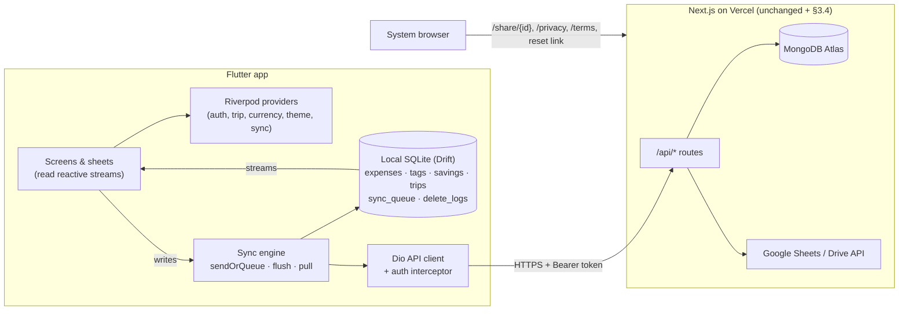
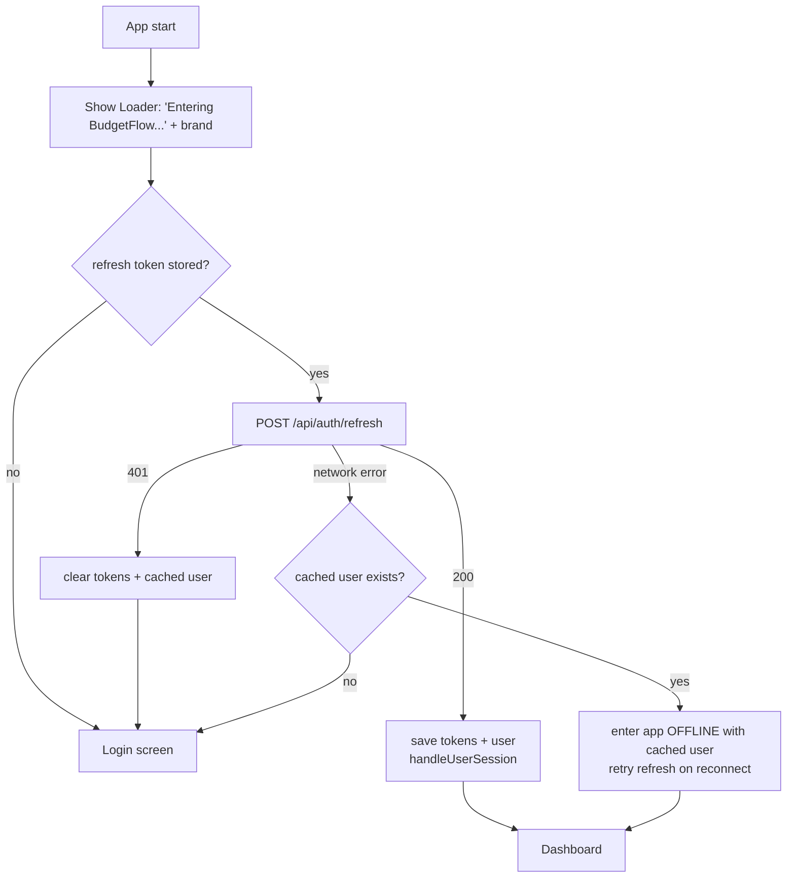

# BudgetFlow Mobile — Flutter Implementation Specification

> **Audience:** engineers and AI coding agents building the Flutter mobile version of BudgetFlow.
> **Source of truth:** this document was written by reading the complete Next.js web app in this repository (`budgetTracker`). Wherever this document and the older design docs (`implementation.md`, `style.md`, `glassmorphism.md`) disagree, **this document reflects what the code actually does** and wins.
> **Goal:** a Flutter app (Android + iOS) with **the same features, data, behaviour and look** as the *mobile* layout of the web app. The **only** feature that is not rebuilt natively is the **public share dashboard** — viewing a shared dashboard opens the website.

---

## Table of Contents

0. [How to use this document (rules for agents)](#0-how-to-use-this-document-rules-for-agents)
1. [Product overview & scope](#1-product-overview--scope)
2. [System architecture](#2-system-architecture)
3. [Backend: base URLs, auth model, required backend changes](#3-backend-base-urls-auth-model-required-backend-changes)
4. [Flutter tech stack](#4-flutter-tech-stack)
5. [Flutter project structure](#5-flutter-project-structure)
6. [Data model (server + local)](#6-data-model-server--local)
7. [Domain rules (trips, tags, savings, recycle bin, ordering)](#7-domain-rules)
8. [API reference (every endpoint the app uses)](#8-api-reference)
9. [Offline-first sync engine](#9-offline-first-sync-engine)
10. [Authentication & session lifecycle](#10-authentication--session-lifecycle)
11. [App state (providers)](#11-app-state-providers)
12. [Design system (tokens, glass, typography, components)](#12-design-system)
13. [Navigation & app shell](#13-navigation--app-shell)
14. [Screen-by-screen specification](#14-screen-by-screen-specification)
15. [Calculations & formatting (exact formulas)](#15-calculations--formatting)
16. [Export: Excel & Google Sheets](#16-export-excel--google-sheets)
17. [Sharing → website hand-off](#17-sharing--website-hand-off)
18. [Local preferences (key/value storage)](#18-local-preferences)
19. [All user-facing messages (toasts, confirms, errors)](#19-all-user-facing-messages)
20. [Known web quirks: replicate or fix](#20-known-web-quirks-replicate-or-fix)
21. [Implementation phases & acceptance criteria](#21-implementation-phases--acceptance-criteria)
22. [Test checklist](#22-test-checklist)
23. [Appendix: constants](#23-appendix-constants)

---

## 0. How to use this document (rules for agents)

1. **Read sections 6, 7 and 9 before writing any data code.** The offline sync engine has invariants that are easy to break (ID formats, delete-log IDs, tag ID reconciliation, entity ordering).
2. **The server is unchanged except for the small additions in §3.4.** All request/response shapes in §8 are the existing API. Payload field names must match exactly (`_id`, `clientId`, `tagIds`, `tripId`, `deleteSnapshot`, …) because the server reads them by name.
3. **Every write goes to the local DB first**, then through `sendOrQueue()` (§9.3). Never call a write API directly from UI code.
4. **UI reads only from the local DB** (reactive streams). The only screens that call the network directly are Profile (Sheets, sharing, recycle-bin refresh, data reset, password reset, Excel) and Auth.
5. **Match the mobile web layout** (the `< 640px` / `< 1024px` layout of the website), not the desktop layout. Section 14 describes the mobile layout of each screen.
6. **UI conventions carried over from the web (mandatory):**
   - No native dropdowns/pickers for choice lists → use the glass **bottom sheet** (`SelectSheet`, §12.9).
   - No `AlertDialog` for confirmations → use `ConfirmSheet` (§12.10).
   - Notifications are **toasts** (bottom-centre glass pill), never alerts/snackbars with default styling.
   - Minimum tap target **44×44 logical px**.
   - Primary buttons in sheets are **full width**, stacked (primary on top, cancel below).
   - Text is never pure black/white — use the tokens in §12.1.
   - Nothing overflows horizontally; long text truncates with ellipsis.
7. **When in doubt, copy the web behaviour**, then check §20 for known web bugs you should *not* copy.
8. Keep names aligned with the web where reasonable (`queueExpenseCreation`, `flushSyncQueue`, `pullFromServer`, `filterExpensesForTrip`, …) so both codebases stay easy to cross-reference.

---

## 1. Product overview & scope

**BudgetFlow** ("Finance Ledger") is a personal, offline-first budget tracker.

### 1.1 Feature list (all must exist in the mobile app)

| # | Feature | Where |
|---|---|---|
| 1 | Email/password register & login | Auth screens |
| 2 | Google sign-in (also grants Google Sheets/Drive scope) | Auth screens |
| 3 | Silent auto-login (15-min access token + 30-day rotating refresh token) | Splash |
| 4 | Forgot password (request reset email) | Auth + Profile |
| 5 | Record / edit / delete expenses (amount, date, note, multiple tags, "paid from savings") | FAB sheet, Expenses |
| 6 | Tags ("categories"), per trip: create / rename / recolour / delete, quick-create inside the expense form | Tags screen, Expense form |
| 7 | Savings vault: deposits, withdrawals linked to expenses, balance | Savings |
| 8 | **Trips**: separate ledgers ("General" + user trips), emoji/colour, dates, complete/reopen, delete, copy categories, **mirroring** ("also count expenses in") | Profile → Trips, Trip switcher |
| 9 | Dashboard analytics: period presets + custom range, tag filter, totals, avg/day, top category, daily activity, spend by category | Dashboard |
| 10 | Offline-first: every write works offline; background sync; sync status everywhere | Everywhere |
| 11 | Recycle bin: restore or permanently delete expenses, savings, categories, trips; empty bin | Profile |
| 12 | Excel export (.xlsx, server-generated) | Profile |
| 13 | Google Sheets sync (in-place update, delete & resync fresh, unlink, copy link/ID, open) | Profile |
| 14 | Sharing management: per-trip public links, monthly vs full report, combined "all shared trips" link | Profile |
| 15 | Currency (10 currencies), decimal places toggle, light/dark/system theme | Profile |
| 16 | Data reset (wipe all expenses + savings) | Profile |

### 1.2 Out of scope / handled by the website

| Item | Mobile behaviour |
|---|---|
| Public shared dashboard (`/share/{shareId}`) | Open `https://money.ashwinsi.in/share/{shareId}` in the external browser (or an in-app browser tab). **Do not rebuild** `SharedSpendingBreakdown`, `SharedExpensesList`, etc. |
| Password reset *completion* (`/reset-password?token=…`) | The email link opens the website. The app only requests the link. |
| Landing page (`/`), Privacy (`/privacy`), Terms (`/terms`) | No landing page in the app. Privacy/Terms open the website. |
| Desktop sidebar, desktop bar chart layout | Not needed (optional tablet layout, §14.4.6). |

### 1.3 Product naming & branding

- Name: **BudgetFlow** — rendered as `Budget` + `Flow` where "Flow" is emerald (`#10B981` light / `#34D399` dark) and in a lighter weight. In the loader, "Flow" is *italic*.
- Tagline under the logo in the drawer: `FINANCE LEDGER` (10–11px, uppercase, tracking-wide, muted).
- Logo asset: `public/logo.png` (512×512). Use it for the launcher icon, splash and app bar.
- Theme colour: `#22C55E`. Splash/background colour: `#F5F0E8`.
- Footer credit (Profile bottom): "Designed & Built by" + link `ashwinn-si` → `https://github.com/ashwinn-si`.

---

## 2. System architecture



Key properties:

- **Local DB is the UI's source of truth.** The server is the durable source of truth; `pullFromServer` reconciles local with server.
- **Writes are optimistic:** local write → try direct POST to `/api/expenses/sync` → on failure/offline, append to `sync_queue` → flushed later.
- **Analytics are computed on-device** from the local DB (the web dashboard does not use `/api/analytics`).

---

## 3. Backend: base URLs, auth model, required backend changes

### 3.1 Base URLs (make both configurable per flavour)

| Constant | Production value | Dev |
|---|---|---|
| `API_BASE_URL` | `https://money.ashwinsi.in` | `http://<LAN-IP>:5173` (Next dev runs on port **5173**) |
| `WEB_BASE_URL` | `https://money.ashwinsi.in` | same as API |

Use `--dart-define` or flavour config (`lib/core/config/env.dart`).

### 3.2 How the server authenticates a request

`getCurrentUser(req)` (in `lib/auth.ts`) checks, in order:

1. `Authorization: Bearer <accessToken>` — JWT (`HS256`, secret `JWT_ACCESS_SECRET`, **15 min**), payload `{ userId, email, name }`.
2. `refreshToken` **cookie** (JWT, secret `JWT_REFRESH_SECRET`, **30 days**).
3. NextAuth session cookie (Google users on the web).

**The mobile app always sends the Bearer header.** Every route supports it.

> ⚠️ Several routes silently fall back to `userId = "local_user"` when no auth is found (e.g. `GET /api/expenses`, `/api/tags`, `/api/savings`, `/api/delete-logs`). The app must never call them unauthenticated; otherwise it would read/write a phantom "local_user" dataset.

### 3.3 Token model

- **Access token**: returned in JSON by login/register/refresh. 15-minute lifetime (hard-coded).
- **Refresh token**: created by `createAndStoreRefreshToken()`: a 30-day JWT whose **bcrypt hash** is stored in the `RefreshToken` collection (TTL-indexed). Today it is only delivered as an `httpOnly` cookie named `refreshToken`.
- **Rotation**: every `POST /api/auth/refresh` **revokes** the presented refresh token and issues a new pair. Reusing an already-rotated token fails (401). → the mobile client must do **single-flight refresh** (§10.4).

### 3.4 Required backend changes (small, additive, web keeps working)

The web relies on cookies and NextAuth redirects, which do not fit a native app. Add the following. Mark mobile requests with header **`X-Client: mobile`**.

#### 3.4.1 Return the refresh token in the body for mobile

In `app/api/auth/login/route.ts`, `app/api/auth/register/route.ts`, `app/api/auth/refresh/route.ts`:

```ts
const isMobile = req.headers.get("x-client") === "mobile";
const response = NextResponse.json({
  user: { /* unchanged */ },
  accessToken,
  ...(isMobile ? { refreshToken } : {}),   // refresh route: newRefreshToken
});
// keep setting the cookie as today (harmless for mobile)
```

#### 3.4.2 Accept the refresh token from the body

In `app/api/auth/refresh/route.ts` and `app/api/auth/logout/route.ts`:

```ts
let bodyToken: string | undefined;
try { bodyToken = (await req.json())?.refreshToken; } catch {}
const refreshTokenCookie = req.cookies.get("refreshToken")?.value || bodyToken;
```

Also pass a device label to `createAndStoreRefreshToken(user, deviceInfo)` — the login and refresh routes already use the `User-Agent` header; send `User-Agent: BudgetFlowMobile/<version> (<platform>)`. (Note: the register route currently omits `deviceInfo`; optional to fix.)

#### 3.4.3 Native Google sign-in endpoint (new)

`POST /api/auth/google/mobile` — body `{ idToken: string, serverAuthCode?: string }`.

Server steps (mirror the NextAuth `signIn` callback in `app/api/auth/[...nextauth]/route.ts`):

1. Verify `idToken` with `google.auth.OAuth2().verifyIdToken({ idToken, audience: [WEB_CLIENT_ID, ANDROID_CLIENT_ID, IOS_CLIENT_ID] })` (the `googleapis` package is already a dependency). Get `email`, `name`, `sub`.
2. If `serverAuthCode` is present, exchange it with the **web** OAuth client (`GOOGLE_CLIENT_ID`/`GOOGLE_CLIENT_SECRET`, redirect URI `""`) via `oauth2Client.getToken(code)` → `access_token`, `refresh_token`.
3. Find user by lower-cased email:
   - **New user** → create `{ name: name || "Google User", email, googleId: sub, googleAccessToken, googleRefreshToken, sheetsLinked: Boolean(access_token) }` and insert the **6 default tags** (§23.1).
   - **Existing user** → if `access_token`: set `googleAccessToken`, `sheetsLinked = true`; if `refresh_token`: set `googleRefreshToken`. Save.
4. `createAndStoreRefreshToken(user, userAgent)` and return exactly the login response shape (`{ user, accessToken, refreshToken }`).

Scopes the app must request: `openid email profile https://www.googleapis.com/auth/spreadsheets https://www.googleapis.com/auth/drive.file`, with offline access (server auth code), so that Google Sheets sync works server-side.

> Alternative if the backend cannot be changed: keep refresh in a persistent cookie jar (`dio_cookie_manager` + `PersistCookieJar`) for email login. This works for email/password, but **Google sign-in still needs §3.4.3**. The recommended path is §3.4.1–3.4.3.

#### 3.4.4 Known backend limitation (do not work around in the app)

Password-reset tokens live in an **in-memory `Map`** in `app/api/auth/reset-password/route.ts`. On serverless hosting, the request and the confirmation can land on different instances. This is a backend issue; the app only calls step 1 (request link).

---

## 4. Flutter tech stack

| Concern | Package (recommended) | Notes |
|---|---|---|
| State management | `flutter_riverpod` (+ `riverpod_annotation` optional) | Maps 1:1 to the web React contexts (§11). |
| Routing | `go_router` with `StatefulShellRoute.indexedStack` | Bottom-nav tabs keep their state. |
| Local DB | `drift` + `sqlite3_flutter_libs` | Reactive `watch()` queries replace Dexie `useLiveQuery`. |
| HTTP | `dio` | Interceptor adds Bearer, handles 401 → single-flight refresh → retry. |
| Secure storage | `flutter_secure_storage` | Access + refresh tokens. |
| Preferences | `shared_preferences` | Replaces `localStorage` keys (§18). |
| Connectivity | `connectivity_plus` | Replaces `navigator.onLine` + `online`/`offline` events. |
| Google sign-in | `google_sign_in` | Use its server-auth-code API for the scopes above. The API changed in v7 (`GoogleSignIn.instance`, `authenticate()`, `authorizationClient.authorizeServer(scopes)`); check the current package docs. |
| Charts | `fl_chart` | Only needed for the optional tablet bar chart (§14.4.6). |
| Calendar | `table_calendar` | Range picker (dashboard custom range) and single-date picker (trip dates) inside bottom sheets. |
| Icons | `lucide_icons_flutter` (or `lucide_icons`) | The web uses **lucide** icons; names in this doc are lucide names. |
| Fonts | Bundle **Poppins** (300–700) and **Open Sans** (300–700) as assets | Bundle them rather than fetching at runtime: the app must render correctly offline. (`google_fonts` with `allowRuntimeFetching = false` + bundled files also works.) |
| Toasts | `toastification` or a small custom overlay | Must match the glass toast (§12.11). |
| Number formatting | `intl` | `NumberFormat` with the currency locale (§15.6). |
| Files / share | `path_provider`, `share_plus`, `open_filex` | Excel export. |
| URLs | `url_launcher` | Website hand-off, open Google Sheet. |
| Clipboard | `flutter/services.dart` `Clipboard` | Copy links / IDs. |
| Splash / icon | `flutter_native_splash`, `flutter_launcher_icons` | From `public/logo.png`, background `#F5F0E8`. |

Minimum targets: Android 7.0 (API 24)+, iOS 13+.

---

## 5. Flutter project structure

```
lib/
  main.dart                       # bootstrap: bindings, DB open, ProviderScope
  app.dart                        # MaterialApp.router, theme, toast overlay, global loader
  core/
    config/env.dart               # API_BASE_URL, WEB_BASE_URL, GOOGLE_* client ids
    theme/
      tokens.dart                 # AppColors light/dark (§12.1), radii, shadows
      app_theme.dart              # ThemeData light/dark, text themes
      glass.dart                  # GlassTier enum + decoration builders
    constants/
      currencies.dart             # SUPPORTED_CURRENCIES (§23.3)
      colors.dart                 # PRESET_COLORS (§23.2)
      emojis.dart                 # QUICK_EMOJIS (§23.4)
    utils/
      ids.dart                    # exp_/sav_/tag_/trip_/del_ id generators (§6.3)
      money.dart                  # formatAmount, formatAmountInput, parseAmountInput
      amount_input_formatter.dart # TextInputFormatter (§15.7)
      dates.dart                  # formatDate (dd-mm-yy), formatTime, formatDateTime, date-only helpers
      time_ago.dart               # "Just now", "5m ago", …
  data/
    local/
      database.dart               # Drift DB + tables (§6.2)
      daos/…                      # expenses_dao, tags_dao, savings_dao, trips_dao, queue_dao, delete_logs_dao
    remote/
      api_client.dart             # Dio instance, base URL, headers
      auth_interceptor.dart       # Bearer + single-flight refresh (§10.4)
      endpoints.dart              # typed wrappers for §8
    sync/
      send_or_queue.dart          # executeDirectSync + sendOrQueue (§9.3)
      queue_expenses.dart         # queueExpenseCreation/Update/Deletion
      queue_savings.dart
      queue_tags.dart             # + deduplicateLocalTags
      queue_trips.dart            # + cascade delete
      delete_logs.dart            # canonical ids, writeDeleteLog, dedup, permanent delete, clear
      recovery.dart               # recoverDeletedItem
      flush.dart                  # flushSyncQueue
      tag_reconcile.dart          # reconcileTagMap, repointTagReferences
      pull/                       # pull_trips, pull_tags, pull_expenses, pull_savings, pull_delete_logs, pull.dart
      sync_controller.dart        # triggers, status, lastSyncedAt
  domain/
    models/                       # Expense, Tag, Saving, Trip, DeleteLog, SyncQueueItem, AuthUser
    trips_logic.dart              # getSourceTripIds, getVisibleTripIds, filterExpensesForTrip, canMirrorInto
    analytics.dart                # date ranges, category breakdown, daily series (§15)
  state/
    auth_provider.dart
    sync_provider.dart
    trip_provider.dart
    currency_provider.dart
    theme_provider.dart
    loading_provider.dart
    db_streams.dart               # stream providers over DAOs
  ui/
    shell/                        # app_shell, bottom_nav, top_bar, app_drawer, atmosphere_background
    widgets/                      # glass_card, app_button, app_sheet, confirm_sheet, select_sheet,
                                  # app_text_field, tag_chip, trip_source_badge, trip_switcher,
                                  # sync_badge, loader, toast, segmented_pills, section_header
    screens/
      splash/  auth/(login, register, forgot_password)
      dashboard/  expenses/  savings/  tags/
      profile/(profile_screen + one widget per card, recycle_bin)
    sheets/                       # expense_form, savings_deposit, tag_form, trip_form,
                                  # mirrored_expense, date_range, trip_switcher_sheet
```

---

## 6. Data model (server + local)

### 6.1 Server (MongoDB / Mongoose) — reference

**User**

| Field | Type | Notes |
|---|---|---|
| `_id` | ObjectId | |
| `name` | string | required |
| `email` | string | unique, lower-cased |
| `passwordHash` | string\|null | null for Google-only accounts |
| `googleId`, `googleAccessToken`, `googleRefreshToken` | string\|null | |
| `sheetsLinked` | bool | default false |
| `sheetsSpreadsheetId` | string\|null | |
| `sheetsLastSyncedAt` | Date\|null | |
| `currency` | string | default `"INR"` |
| `isSharingEnabled`, `shareId` | legacy user-level share (General) | |
| `isCombinedSharingEnabled`, `combinedShareId` | combined share link | |

**Expense** — `userId`, `amount (>=0)`, `note`, `tagIds: ObjectId[] (ref Tag)`, `date: Date`, `clientId`, `tripId (default "general")`, `syncStatus`, `createdAt`, `updatedAt`.

**Tag** — `userId`, `name`, `colorKey (hex, default #22C55E)`, `clientId`, `tripId (default "general")`. Unique index `{ userId, tripId, name }`.

**Saving** — `userId`, `amount`, `type: "deposit"|"withdrawal"`, `note`, `date`, `clientId`, `linkedExpenseId` (the **clientId** of the linked expense), `syncStatus`.

**Trip** — `userId`, `tripId` (string id, unique per user), `name`, `emoji`, `colorKey`, `isDefault`, `status: "active"|"completed"`, `completedAt`, `mirrorToTripIds: string[]`, `startDate`, `endDate`, `isSharingEnabled`, `shareId`, `shareMode: "monthly"|"full"`.

**DeleteLog** — `userId`, `entityType: "expense"|"saving"|"tag"|"trip"`, `entityId`, `title`, `details`, `data (snapshot)`, `deletedAt`.

**RefreshToken** — `userId`, `tokenHash`, `deviceInfo`, `expiresAt (TTL)`, `revokedAt`.

### 6.2 Local database (Drift) — mirrors the web's Dexie schema v6

Store dates as **strings** exactly like the web so payloads round-trip unchanged.

```dart
class Expenses extends Table {
  TextColumn get clientId => text()();                 // PK
  TextColumn get serverId => text().nullable()();      // web: _id (Mongo ObjectId)
  TextColumn get userId => text()();
  RealColumn get amount => real()();
  TextColumn get note => text().withDefault(const Constant(''))();
  TextColumn get tagIds => text().withDefault(const Constant('[]'))(); // JSON array of tag ids
  TextColumn get date => text()();                     // 'YYYY-MM-DD'
  TextColumn get createdAt => text()();                // ISO-8601
  TextColumn get updatedAt => text()();                // ISO-8601
  TextColumn get syncStatus => text()();               // synced|syncing|pending|conflict
  TextColumn get tripId => text().withDefault(const Constant('general'))();
  @override Set<Column> get primaryKey => {clientId};
}

class Tags extends Table {
  TextColumn get id => text()();                       // web: _id  (ObjectId OR local 'tag_…')
  TextColumn get userId => text()();
  TextColumn get name => text()();
  TextColumn get colorKey => text()();
  TextColumn get tripId => text().withDefault(const Constant('general'))();
  TextColumn get createdAt => text().nullable()();
  @override Set<Column> get primaryKey => {id};
}

class Savings extends Table {
  TextColumn get clientId => text()();                 // PK
  TextColumn get serverId => text().nullable()();
  TextColumn get userId => text()();
  RealColumn get amount => real()();
  TextColumn get type => text()();                     // deposit|withdrawal
  TextColumn get note => text().withDefault(const Constant(''))();
  TextColumn get date => text()();                     // 'YYYY-MM-DD'
  TextColumn get createdAt => text()();
  TextColumn get updatedAt => text()();
  TextColumn get syncStatus => text()();
  TextColumn get linkedExpenseId => text().nullable()(); // expense clientId
  @override Set<Column> get primaryKey => {clientId};
}

class Trips extends Table {
  TextColumn get tripId => text()();                   // PK ('general' or 'trip_…')
  TextColumn get serverId => text().nullable()();
  TextColumn get userId => text()();
  TextColumn get name => text()();
  TextColumn get emoji => text().withDefault(const Constant(''))();
  TextColumn get colorKey => text().withDefault(const Constant('#22C55E'))();
  BoolColumn get isDefault => boolean().withDefault(const Constant(false))();
  TextColumn get status => text().withDefault(const Constant('active'))();
  TextColumn get completedAt => text().nullable()();
  TextColumn get mirrorToTripIds => text().withDefault(const Constant('[]'))(); // JSON
  TextColumn get startDate => text().nullable()();     // 'YYYY-MM-DD' or ISO
  TextColumn get endDate => text().nullable()();
  BoolColumn get isSharingEnabled => boolean().withDefault(const Constant(false))();
  TextColumn get shareId => text().nullable()();
  TextColumn get shareMode => text().nullable()();     // monthly|full|null
  TextColumn get createdAt => text().nullable()();
  TextColumn get updatedAt => text().nullable()();
  @override Set<Column> get primaryKey => {tripId};
}

class SyncQueue extends Table {
  IntColumn get id => integer().autoIncrement()();
  TextColumn get clientId => text()();
  TextColumn get action => text()();                   // create|update|delete
  TextColumn get entity => text()();                   // expense|tag|saving|trip
  TextColumn get payload => text()();                  // JSON object (exact web payload)
  IntColumn get createdAt => integer()();              // epoch ms
}

class DeleteLogs extends Table {
  TextColumn get id => text()();                       // ALWAYS 'del_${entityId}'
  TextColumn get serverId => text().nullable()();      // web: _id
  TextColumn get userId => text()();
  TextColumn get entityType => text()();               // expense|saving|tag|trip
  TextColumn get entityId => text()();                 // indexed
  TextColumn get title => text()();
  TextColumn get details => text().withDefault(const Constant(''))();
  TextColumn get data => text()();                     // JSON snapshot
  TextColumn get deletedAt => text()();                // ISO
  TextColumn get syncStatus => text().nullable()();    // synced|syncing|pending
  @override Set<Column> get primaryKey => {id};
}
```

Indexes: `expenses(tripId)`, `expenses(serverId)`, `expenses(date)`, `tags(tripId)`, `savings(linkedExpenseId)`, `savings(serverId)`, `sync_queue(entity)`, `delete_logs(entityId)`, `delete_logs(entityType)`.

**JSON (de)serialisation for queue payloads uses the web field names**: `_id` (not `serverId`), `clientId`, `tagIds`, `tripId`, etc.

### 6.3 ID formats (must match the web exactly)

`rand(n)` = `n` random chars from `0-9a-z` (the web uses `Math.random().toString(36).substring(2, 2+n)`).

| Entity | Format | Example |
|---|---|---|
| Expense `clientId` | `exp_${epochMs}_${rand(6)}` | `exp_1790000000000_k3j9x2` |
| Saving `clientId` | `sav_${epochMs}_${rand(6)}` | |
| Tag local `_id` | `tag_${epochMs}_${rand(4)}` (expense form) or `rand(5)` (tags page, trip copy) | |
| Trip `tripId` | `trip_${epochMs}_${rand(5)}` | |
| General trip | literal `general` | |
| Delete log `id` | `del_${entityId}` | `del_exp_1790000000000_k3j9x2` |

`getAddedTimestamp` (§15.4) parses the ms out of `exp_<ms>_…`, so keep the format.

Server tag ids are 24-hex Mongo ObjectIds. `isObjectId(s) = RegExp(r'^[a-f\d]{24}$', caseSensitive: false).hasMatch(s)`.

---

## 7. Domain rules

### 7.1 Trips

- Every user has a built-in **General** trip: `tripId = "general"`, `name "General"`, `isDefault true`, `colorKey #22C55E`, `emoji ""`. It **cannot be completed or deleted**. Ensure it exists locally as soon as a user is known (`ensureLocalGeneralTrip(userId)`), even before the first pull.
- Every expense and tag has a `tripId` (missing → `"general"`). **Savings are global** (no tripId).
- **Active trip**: a user-selected trip that scopes the Dashboard, Expenses, Tags, Excel export and Sheets sync. Persisted locally (`budget_active_trip_id`). If it no longer exists → fall back to `general`.
- **Trip ordering** (switcher, lists): General first, then by `createdAt` ascending (trips without `createdAt` last).
- **Status**: `active` / `completed` (`completedAt` set when completed, cleared when reopened).
- **Mirroring** (`mirrorToTripIds`): trip A with `mirrorToTripIds: [B]` means "expenses added to A **also count in** B". Not transitive.

```dart
// Trips (other than target) whose mirrorToTripIds includes target.
List<String> getSourceTripIds(List<Trip> trips, String targetTripId) =>
  trips.where((t) => t.tripId != targetTripId && t.mirrorToTripIds.contains(targetTripId))
       .map((t) => t.tripId).toList();

List<String> getVisibleTripIds(List<Trip> trips, String target) =>
  [target, ...getSourceTripIds(trips, target)];

({List<Expense> own, List<Expense> mirrored, List<Expense> all})
filterExpensesForTrip(List<Expense> expenses, String targetTripId, List<Trip> trips) {
  final sources = getSourceTripIds(trips, targetTripId).toSet();
  final own = <Expense>[], mirrored = <Expense>[];
  for (final e in expenses) {
    final tid = e.tripId.isEmpty ? 'general' : e.tripId;
    if (tid == targetTripId) own.add(e);
    else if (sources.contains(tid)) mirrored.add(e);
  }
  return (own: own, mirrored: mirrored, all: [...own, ...mirrored]);
}

// False for same trip, or if target already mirrors into source (2-cycle).
bool canMirrorInto(List<Trip> trips, String sourceTripId, String targetTripId) {
  if (sourceTripId == targetTripId) return false;
  final target = trips.where((t) => t.tripId == targetTripId).firstOrNull;
  if (target != null && target.mirrorToTripIds.contains(sourceTripId)) return false;
  return true;
}
```

- **Mirrored expenses are read-only** in the target trip: Expenses screen shows an **Eye** button that opens the *Mirrored expense* sheet (§14.6) instead of Edit/Delete.
- **Deleting a trip** cascades: all its expenses and tags are deleted (snapshotted into one delete log), pending queue items for that trip are dropped, and the trip id is removed from other trips' `mirrorToTripIds`.
- **Share mode** default: General → `monthly`, other trips → `full` (`trip.shareMode ?? (tripId == 'general' ? 'monthly' : 'full')`).

### 7.2 Tags (categories)

- Tags belong to a trip. Names are unique **per trip, case-insensitive** (enforced client-side; server has a unique index on exact name).
- UI lists show only tags of the active trip. **Lookups for display** (chips on mirrored expenses, recycle bin) use **all** tags across trips.
- The expense form de-duplicates tags by lower-cased trimmed name.
- Deleting a tag removes its id from every local expense's `tagIds` and stores `affectedExpenseClientIds` in the delete log, so a restore can re-attach it.
- New users get 6 default tags on the server (§23.1) — they arrive via pull.

### 7.3 Savings

- `balance = Σ deposits − Σ withdrawals` (all-time, not trip-scoped, not period-scoped).
- **"Paid from savings"** on an expense creates a `withdrawal` saving with `linkedExpenseId = expense.clientId`, same `amount` and `date`, note `"Paid from savings: {note}"` (or `"Paid from savings"` if note empty).
- Editing that expense keeps the linked withdrawal in sync (amount/date/note). Turning the toggle off deletes the withdrawal.
- **Deleting an expense** also deletes its linked saving. **Deleting a saving** also deletes its linked expense.
- Editing a withdrawal from the Savings screen opens the **expense form** for the linked expense.

### 7.4 Recycle bin (delete logs) — invariants

- **At most one local delete log per entity**, stored under id **`del_${entityId}`**. Never generate timestamp-based ids.
- `writeDeleteLog(log)`: delete every row where `entityId == log.entityId`, delete `del_${entityId}`, then insert with `id = del_${entityId}`.
- `purgeDeleteLogsFor(entityId)`: the same delete without an insert (used when the entity was already gone locally).
- Server logs are mapped with `mapServerDeleteLog` (§9.7) to the same canonical id.
- `deduplicateDeleteLogs()` runs on app start, after each pull, after recovery and after permanent delete (§9.7).
- **Delete handlers clear their "item to delete" UI state *before* awaiting the deletion** so a double tap can't delete twice. `ConfirmSheet` also has a submit lock.

### 7.5 Expense ordering (mandatory)

Expense lists are ordered by **time added, newest first** — not by transaction date. See `getAddedTimestamp` in §15.4.

---

## 8. API reference

All requests: `Content-Type: application/json`, `Authorization: Bearer <accessToken>`, `X-Client: mobile`, `User-Agent: BudgetFlowMobile/<ver>`. On **401** → refresh once (§10.4) → retry once.

### 8.1 Auth

| Method & path | Body | Success response | Errors |
|---|---|---|---|
| `POST /api/auth/register` | `{ name, email, password }` (password ≥ 6) | `{ user:{id,name,email,currency}, accessToken, refreshToken* }` | 400 `"Name, email, and password are required."`, 400 `"Password must be at least 6 characters long."`, 409 `"An account with this email already exists."` |
| `POST /api/auth/login` | `{ email, password }` | `{ user:{id,name,email,currency,sheetsLinked,sheetsSpreadsheetId,sheetsLastSyncedAt,isSharingEnabled,shareId}, accessToken, refreshToken* }` | 400 `"Email and password are required."`, 401 `"Invalid email or password."` |
| `POST /api/auth/refresh` | `{ refreshToken }`* | `{ accessToken, refreshToken*, user:{…same as login} }` | 401 `"No active session or valid refresh token"` |
| `POST /api/auth/logout` | `{ refreshToken }`* | `{ success:true }` | never fails |
| `POST /api/auth/google/mobile`* | `{ idToken, serverAuthCode? }` | same as login | 401 invalid token |
| `POST /api/auth/reset-password` | `{ email }` | `{ success, message: "If an account exists, a reset link has been dispatched.", devResetUrl? }` | 400 `"Email is required"` |

`*` = requires the §3.4 backend change.

Demo account (from seed): `user@gmail.com` / `root` (only if the seed script was run).

### 8.2 Sync (the write path for all entities)

`POST /api/expenses/sync`

```json
{ "items": [ { "clientId": "exp_…", "action": "create|update|delete",
               "entity": "expense|tag|saving|trip", "payload": { … }, "createdAt": 1790000000000 } ] }
```

Response:

```json
{ "success": true, "processed": 3, "failed": 0,
  "tagMap": { "tag_1790…_ab12": "66f1c0…(ObjectId)", "general:groceries": "66f1c0…" },
  "failedItems": [ { "clientId": "…", "entity": "expense", "action": "create", "reason": "…" } ] }
```

- 401 unauthenticated · 400 malformed body · **503** DB unavailable (keep queue, retry later) · 500 unexpected.
- The server sorts items: **trips → tags → everything else**, and processes each in isolation (one bad item doesn't fail the batch).
- `tagMap` maps local tag ids (and `"{tripId}:{lower name}"`) to server ObjectIds → apply with `reconcileTagMap` (§9.5).

**Payloads per entity/action (exactly what the web sends):**

| Entity | create / update payload | delete payload |
|---|---|---|
| expense | the full local expense JSON: `{ _id?, clientId, userId, amount, note, tagIds, date, createdAt, updatedAt, syncStatus, tripId }` | `{ clientId, deleteSnapshot: {…full expense} }` (snapshot omitted if not found locally) |
| saving | full local saving JSON: `{ _id?, clientId, userId, amount, type, note, date, createdAt, updatedAt, syncStatus, linkedExpenseId? }` | `{ clientId, deleteSnapshot: {…} }` |
| tag | create: `{ _id, userId, name, colorKey, tripId }` · update: `{ id: _id, _id, userId, name, colorKey, tripId }` | `{ tagId, name, tripId, deleteSnapshot: {…tag, affectedExpenseIds: [expense clientIds]} }` |
| trip | full local trip JSON (`tripId, name, emoji, colorKey, isDefault, status, completedAt, mirrorToTripIds, startDate, endDate, …`) | `{ tripId }` |

Queue item `clientId`: expense/saving → their `clientId`; tag → tag `_id`; trip → `tripId`.

Server behaviour worth knowing:
- Expense upsert key: `clientId` (falls back to `_id`). Tag ids that can't be resolved are **dropped silently**; tags from another trip are dropped.
- Tag create upserts by `{ name, userId, tripId }`.
- Trip `update` for a trip that doesn't exist yet is turned into an upsert.
- `status: "completed"` on General is rejected.
- Deletes write a server `DeleteLog` (from the DB doc, or from `deleteSnapshot` if the doc no longer exists).

### 8.3 Reads used by pull

| Path | Response | Notes |
|---|---|---|
| `GET /api/trips` | `{ trips: Trip[] }` sorted General first then `createdAt` | 401/503 on failure. Creates General server-side if missing. |
| `GET /api/tags` | `{ tags: [{ _id, userId, name, colorKey, clientId?, tripId, expenseCount }] }` | |
| `GET /api/expenses` | `{ expenses: [...] }` — **no query params = all expenses of all trips**; `tagIds` are **populated objects** (`{_id, name, colorKey, …}`) | Optional filters exist (`startDate,endDate,tagIds,search,tripId`) but pull uses none. |
| `GET /api/savings` | `{ success, savings: [...] }` | |
| `GET /api/delete-logs` | `{ success, deleteLogs: [...] }` sorted by `deletedAt` desc | |

### 8.4 Recycle bin

| Path | Body/query | Response |
|---|---|---|
| `POST /api/delete-logs/recover` | `{ logId?, entityId? }` | `{ success, message, entityType, entityId }` (trip: also `counts`) · 404 `"Delete log record not found"` |
| `DELETE /api/delete-logs?id={id}` | id may be server `_id`, `entityId`, or `del_{entityId}` | `{ success }` |
| `DELETE /api/delete-logs?all=true` | — | `{ success }` |

### 8.5 Profile / preferences / sharing

| Path | Body | Response |
|---|---|---|
| `GET /api/user/preferences` | — | `{ currency }` |
| `PATCH /api/user/preferences` | `{ currency: "USD" }` | `{ success, currency }` |
| `GET /api/user/share` | — | `{ success, isCombinedSharingEnabled, combinedShareId }` |
| `PATCH /api/user/share` (trip) | `{ tripId, isSharingEnabled? , shareMode?: "monthly"|"full" }` | `{ success, tripId, isSharingEnabled, shareId, shareMode }` |
| `PATCH /api/user/share` (combined) | `{ scope: "all", isSharingEnabled: bool }` | `{ success, scope:"all", isCombinedSharingEnabled, combinedShareId }` |
| `POST /api/expenses/clear` | `{}` (or `{ tripId }` for trip-only clear, not used by UI) | `{ success, deletedExpenses, deletedSavings }` |

### 8.6 Export

| Path | Body/query | Response |
|---|---|---|
| `GET /api/export/excel?tripId=…[&startDate=YYYY-MM-DD&endDate=YYYY-MM-DD&tagIds=a,b&tagNames=A,B]` | — | `.xlsx` bytes; filename in `Content-Disposition` (`budget-tracker-export[-trip-slug]-{start}-to-{end}.xlsx`) |
| `GET /api/export/sheets` | — | `{ linked, spreadsheetId, url, lastSyncedAt }` |
| `POST /api/export/sheets` | `{ tripId }` or `{ action: "fresh", tripId }` | `{ success, action: "create"|"update"|"fresh", spreadsheetId, lastSyncedAt, url, message }` · 400 `"Google Sheets is not linked. Sign in with Google with spreadsheets scope enabled."` · 500 `"Google authorization expired. Please sign out and sign in with Google again."` |
| `DELETE /api/export/sheets` | — | `{ success, message }` (trashes the Drive file and clears the link) |

---

## 9. Offline-first sync engine

### 9.1 Overview

```mermaid
sequenceDiagram
  participant UI
  participant Q as queue*() helpers
  participant L as Local DB
  participant S as sendOrQueue
  participant API as POST /api/expenses/sync
  UI->>Q: queueExpenseCreation(expense)
  Q->>L: put(expense, syncStatus = online ? "syncing" : "pending")
  Q->>S: item {clientId, action, entity, payload, createdAt}
  alt online
    S->>API: {items:[item]} (401 → refresh → retry once)
    API-->>S: {success, tagMap, failedItems?}
    S->>L: reconcileTagMap(tagMap); mark synced
  else offline or failed or failedItems non-empty
    S->>L: sync_queue.add(item); expense.syncStatus = "pending"
  end
  L-->>UI: streams re-emit (instant UI update)
```

### 9.2 Online detection

`isOnline()` = last `connectivity_plus` result ≠ `none`. Connectivity isn't reachability; that's fine, because a failed request falls back to the queue.

### 9.3 `executeDirectSync` / `sendOrQueue`

```dart
Future<bool> executeDirectSync(SyncQueueItem item) async {
  if (!isOnline()) return false;
  try {
    final res = await api.post('/api/expenses/sync', data: {'items': [item.toJson()]}); // interceptor handles 401 refresh+retry
    final data = res.data as Map<String, dynamic>;
    if ((data['failedItems'] as List?)?.isNotEmpty ?? false) return false;
    if (data['tagMap'] is Map) await reconcileTagMap(Map<String, String>.from(data['tagMap']));
    if (item.action != 'delete') {
      if (item.entity == 'expense') await db.expensesDao.setStatus(item.clientId, 'synced');
      if (item.entity == 'saving')  await db.savingsDao.setStatus(item.clientId, 'synced');
    }
    return true;
  } catch (_) { return false; }            // network/5xx → caller queues
}

Future<bool> sendOrQueue(SyncQueueItem item) async {
  if (isOnline() && await executeDirectSync(item)) return true;
  await db.queueDao.add(item);
  return false;
}
```

### 9.4 Queue helpers (write API used by UI)

**Expenses / savings (`saveAndSync`)**

```text
queueExpenseCreation(e) / queueExpenseUpdate(e):
  status = isOnline ? "syncing" : "pending"
  local = e.copy(syncStatus: status, updatedAt: action==update ? nowIso : e.updatedAt)
  db.expenses.put(local)
  sent = sendOrQueue({clientId: e.clientId, action, entity:"expense", payload: local.toJson(), createdAt: nowMs})
  if (!sent && status == "syncing") db.expenses.update(e.clientId, syncStatus:"pending")

queueExpenseDeletion(clientId):
  exp = db.expenses.get(clientId)
  if exp: writeDeleteLog({userId, entityType:"expense", entityId: clientId,
                          title: exp.note.trim() or "Expense",
                          details: exp.date.split("T")[0] or "Recent",
                          data: exp.toJson(), deletedAt: nowIso, syncStatus:"pending"})
  else:   purgeDeleteLogsFor(clientId)
  db.expenses.delete(clientId)
  sendOrQueue({clientId, action:"delete", entity:"expense",
               payload:{clientId, if exp: deleteSnapshot: exp.toJson()}})
```

Savings are identical with `entity:"saving"` and title `note or ("Savings Deposit" | "Savings Withdrawal")`.

**Tags**

```text
queueTagCreation(tag): db.tags.put(tag); sendOrQueue({clientId: tag._id, action:"create", entity:"tag", payload: tag})
queueTagUpdate(tag):   db.tags.put(tag); sendOrQueue({clientId: tag._id, action:"update", entity:"tag", payload:{id: tag._id, ...tag}})
queueTagDeletion(tagId):
  tag = db.tags.get(tagId)
  affected = expenses where tagIds contains tagId → clientIds
  if tag: writeDeleteLog({entityType:"tag", entityId: tagId, title: tag.name,
                          details:"Category • ${tag.colorKey}", data:{...tag, affectedExpenseClientIds: affected}})
  else purgeDeleteLogsFor(tagId)
  db.tags.delete(tagId); remove tagId from every expense.tagIds (local put, NOT queued)
  sendOrQueue({clientId: tagId, action:"delete", entity:"tag",
               payload:{tagId, name: tag?.name ?? "", tripId: tag?.tripId ?? "general",
                        if tag: deleteSnapshot:{...tag, affectedExpenseIds: affected}}})
```

**`deduplicateLocalTags()`** (run before every flush and before/after every pull, and when the Tags screen opens): group tags by `"{tripId}|{lower trimmed name}"`; in each group keep the one with an ObjectId id (else the first); re-point expenses and queued expense payloads to it (de-duplicating tagIds); delete the others.

**Trips**

```text
queueTripCreation(trip, copyTagsFromTripId?):
  db.trips.put(trip); sendOrQueue({clientId: trip.tripId, action:"create", entity:"trip", payload: trip})
  if copyTagsFromTripId: for each tag of that trip → queueTagCreation(new tag with id tag_${ms}_${rand5},
                                                     same name/colorKey, tripId = trip.tripId)
queueTripUpdate(trip): db.trips.put(trip); sendOrQueue({... action:"update" ...})
queueTripDeletion(tripId) → bool:
  if tripId == "general" or not found: return false
  tripTags, tripExpenses = local rows with that tripId
  hadPendingCreate = queue has {entity:"trip", action:"create", clientId: tripId}
  delete queue items where (entity=="trip" && clientId==tripId) || (entity in [expense,tag] && payload.tripId==tripId)
  writeDeleteLog({entityType:"trip", entityId: tripId, title: trip.name,
                  details:"Trip • ${n} expenses • ${m} categories",
                  data:{trip, tags: tripTags, expenses: tripExpenses}})
  delete those expenses, tags, the trip; remove tripId from every trip.mirrorToTripIds
  if !hadPendingCreate: sendOrQueue({clientId: tripId, action:"delete", entity:"trip", payload:{tripId}})
  return true
```

### 9.5 Tag id reconciliation

```text
reconcileTagMap(map):
  for (localId, serverId) in map where both set and localId != serverId:
    if db.tags.get(localId) exists: delete it and put the same tag with id = serverId
    repointTagReferences(localId, serverId)

repointTagReferences(oldId, newId):
  every local expense whose tagIds contains oldId → replace with newId
  every queued EXPENSE item whose payload.tagIds contains oldId → replace with newId
```

Keys like `"general:groceries"` in `tagMap` simply won't match a local tag id; that's fine.

### 9.6 `flushSyncQueue()`

```text
if isFlushing: return success(0)          // module-level lock
if !isOnline: return failure("Offline")
isFlushing = true
try:
  deduplicateLocalTags()
  items = queue.all(); if empty return success(0)
  POST /api/expenses/sync {items}         // 401 → refresh → retry once
  503 → failure("Server DB unavailable") (keep queue)
  401 → failure("Unauthorized — token expired")
  !ok → failure("Server response: $code")
  reconcileTagMap(data.tagMap)
  failed = set of data.failedItems[].clientId
  for item in items (not in failed):
     if expense/saving and action != delete and row exists → syncStatus "synced"
     queue.delete(item.id)
  return success(count)
finally: isFlushing = false
```

Failed items stay in the queue and are retried on every flush (see §20 for an optional retry cap).

### 9.7 `pullFromServer()`

Order matters: **trips → tags → expenses → savings → delete logs**. Each step is skipped (not fatal) if its GET fails. Before and after: `deduplicateLocalTags()`.

1. **Trips** — `GET /api/trips` → map each (dates → ISO, `_id` → serverId) → upsert all. Delete local trips that are not on the server **and** not in queued trip items. Then `ensureLocalGeneralTrip(userId)`.
2. **Tags** — `GET /api/tags`. For each server tag `s`, find a local tag `l` with a different id that matches by (lower name **and** same tripId) or `l.id == s.clientId` → `repointTagReferences(l.id, s._id)` and delete `l`. Then upsert all server tags (`id = _id`, `tripId` default `general`). Delete local tags not on the server and not in queued **tag** items.
3. **Expenses** — `GET /api/expenses`. `pending` = set of **all** queued items' clientIds. For each server expense: `clientId = sExp.clientId ?? sExp._id`; skip if pending; if a local row has the same serverId under a different clientId → delete it; upsert with `serverId = _id`, `amount = num`, `tagIds = populated objects → their _id`, `date = date-only (split at 'T')`, `createdAt/updatedAt` ISO, `syncStatus "synced"`, `tripId ?? "general"`. Then delete local expenses whose clientId is neither pending nor on the server.
4. **Savings** — same as expenses (`type` default `deposit`, `linkedExpenseId`).
5. **Delete logs** — `GET /api/delete-logs` → put `mapServerDeleteLog(s)` for each → `deduplicateDeleteLogs()`.

```text
mapServerDeleteLog(s):
  entityId = s.entityId ?? s.data.clientId ?? s.data._id ?? s._id
  → { id: "del_$entityId", serverId: s._id, userId, entityType, entityId, title,
      details: s.details ?? "", data: s.data ?? {}, deletedAt: ISO, syncStatus: "synced" }

deduplicateDeleteLogs():
  active ids: expense clientIds, saving clientIds, tag ids, trip ids
  for each log: entityId = log.entityId ?? strip /^del_(exp_|sav_|tag_|trip_)?/ from log.id
     if entity is active again → delete log
     else group by "$entityType:$entityId"
  for each group: best = prefer has serverId, then syncStatus "synced", then latest deletedAt
     delete all rows of the group; put best with id = "del_$entityId", entityId
```

### 9.8 Sync triggers (`SyncController`)

| Trigger | Web | Mobile |
|---|---|---|
| App start | after `cleanUpLegacyDefaultTags()` + `deduplicateDeleteLogs()` → `triggerSync()` | same, after auth is resolved |
| Connectivity regained | `online` event → `triggerSync()` | `connectivity_plus` stream none → wifi/mobile |
| Queue becomes non-empty | debounce **1500 ms** while online and not syncing | same (watch queue count stream) |
| Manual | "Sync" / "Sync Now" buttons | same |
| App resumed | — | **add**: `AppLifecycleState.resumed` → `triggerSync()` |

```text
triggerSync():
  if !online || isSyncing: return
  isSyncing = true
  result = flushSyncQueue(); pullFromServer()
  if result.success: lastSyncedAt = now; prefs["budget_last_synced"] = ISO
  isSyncing = false
```

`cleanUpLegacyDefaultTags()` removes old pre-seeded local tags with ids `tag_groceries, tag_dining, tag_housing, tag_wellness, tag_transport, tag_leisure`, re-pointing references to a same-named real tag. A fresh Flutter install never creates these, so it can be skipped; keep it only if you import web data.

### 9.9 Sync status (shown in the top bar, drawer and Profile)

```
status = !online ? "offline" : isSyncing ? "syncing" : pendingCount > 0 ? "pending" : "synced"
pendingCount = sync_queue row count (reactive)
```

Per-row badges: expenses/savings show **CheckCircle2** (emerald/teal) when `syncStatus == "synced"`, else **Clock** (amber, pulsing).

### 9.10 Recovery (`recoverDeletedItem(logId)`)

```text
{log} = find by id | entityId | serverId
if not found locally:
   POST /api/delete-logs/recover {logId}; if ok → pullFromServer(); dedup; success
   else failure("Record not found in recycle bin")
switch log.entityType:
  expense: queueExpenseCreation({...data, clientId: data.clientId ?? entityId,
             tripId: resolveTripId(data.tripId), syncStatus:"pending", updatedAt: now})
  saving:  queueSavingCreation({...data, clientId: data.clientId ?? entityId, syncStatus:"pending", updatedAt: now})
  tag:     t = {...data, _id: data._id ?? entityId, tripId: resolveTripId(data.tripId)}; queueTagCreation(t)
           for cId in (data.affectedExpenseClientIds ?? data.affectedExpenseIds):
               if expense exists and lacks t._id → add it and queueExpenseUpdate(exp)
  trip:    queueTripCreation({...snapshot.trip, tripId: snapshot.trip.tripId ?? entityId})
           each snapshot tag → queueTagCreation({...tag, tripId})
           each snapshot expense → queueExpenseCreation({...exp, tripId, syncStatus:"pending", updatedAt: now})
remove all local copies of the log (same id | entityId | serverId)
POST /api/delete-logs/recover {logId: log.serverId ?? log.id, entityId: log.entityId}  (ignore network errors)
deduplicateDeleteLogs()
resolveTripId(t): t is empty/general → general; else t exists locally ? t : general
```

**Permanent delete**: remove all local copies; `DELETE /api/delete-logs?id={serverId ?? entityId ?? logId}`; dedup.
**Empty bin**: clear local table; `DELETE /api/delete-logs?all=true`.

---

## 10. Authentication & session lifecycle

### 10.1 Storage

| Item | Where |
|---|---|
| accessToken, refreshToken | `flutter_secure_storage` (`bf_access_token`, `bf_refresh_token`) |
| cached user JSON | `shared_preferences` `budget_local_user` |
| active user id | `budget_active_user_id` |

### 10.2 Cold start (Splash)



> The web logs the user out if the network is down at startup. The mobile app **must** allow offline entry with the cached user (this is an offline-first app); see §20.

### 10.3 `handleUserSession(user, token)` (after login/register/refresh/Google)

1. If `prefs.budget_active_user_id` exists and ≠ `user.id` → **wipe the local DB** (`clearLocalUserData`: expenses, tags, savings, sync_queue, delete_logs, trips).
2. Save `budget_active_user_id = user.id`, `budget_local_user = json(user)`.
3. `ensureLocalGeneralTrip(user.id)`.
4. `await pullFromServer()`.
5. Currency provider picks up `user.currency` (§11).

### 10.4 Auth interceptor (single-flight refresh)

```dart
class AuthInterceptor extends QueuedInterceptor {
  Future<String?>? _refreshing;               // shared in-flight refresh

  @override
  void onRequest(o, h) async {
    final t = await storage.read(key: 'bf_access_token');
    if (t != null) o.headers['Authorization'] = 'Bearer $t';
    o.headers['X-Client'] = 'mobile';
    h.next(o);
  }

  @override
  void onError(DioException e, h) async {
    final isRefreshCall = e.requestOptions.path.endsWith('/api/auth/refresh');
    if (e.response?.statusCode != 401 || isRefreshCall || e.requestOptions.extra['retried'] == true) {
      return h.next(e);
    }
    _refreshing ??= _doRefresh().whenComplete(() => _refreshing = null);
    final newToken = await _refreshing;
    if (newToken == null) { authController.onSessionExpired(); return h.next(e); }
    final opts = e.requestOptions..headers['Authorization'] = 'Bearer $newToken'..extra['retried'] = true;
    h.resolve(await dio.fetch(opts));
  }
}
```

`_doRefresh()` posts `{ refreshToken }`, stores the new access **and** refresh token, and updates the cached user. **Never run two refreshes concurrently**: rotation revokes the old token, so a second concurrent refresh would fail and log the user out.

`onSessionExpired()` (refresh returned 401): clear tokens and go to Login. If the refresh failed because of the network, keep the user signed in (offline).

### 10.5 Login / Register / Google

- **Login**: `POST /api/auth/login` → on 200 `handleUserSession` → navigate to Dashboard. On error show the server's `error` in the red error box (`"Login failed"` default, `"Network error during login"` on network failure).
- **Register**: same with `/api/auth/register` (`"Registration failed"`, `"Network error during registration"`).
- **Google**: native sign-in with the scopes from §3.4.3 → `POST /api/auth/google/mobile` → `handleUserSession`.
- If a user is already signed in, the auth screens redirect to Dashboard.

### 10.6 Logout

1. `POST /api/auth/logout` with `{ refreshToken }` (ignore errors).
2. Clear in-memory user/token; delete secure storage tokens.
3. Remove prefs: `budget_local_user`, `budget_active_user_id`, `budget_last_synced`, `budget_active_trip_id` (and `budget_sheets_url`).
4. `clearLocalUserData()` (all six tables).
5. Google sign-out (if signed in with Google).
6. Navigate to Login.

---

## 11. App state (providers)

| Web context | Riverpod provider | Holds / exposes |
|---|---|---|
| `AuthContext` | `authControllerProvider` (AsyncNotifier) | `user`, `accessToken`, `isLoading`, `login`, `register`, `signInWithGoogle`, `logout`, `updateUser(partial)` (also persists `budget_local_user`) |
| `useSync` | `syncControllerProvider` | `isOnline`, `isSyncing`, `status`, `pendingCount` (stream), `lastSyncedAt`, `syncNow()` |
| `TripContext` | `tripControllerProvider` | `trips` (sorted), `activeTrips`, `completedTrips`, `activeTripId` (resolved), `activeTrip` (placeholder General if missing), `setActiveTrip(id)`, `getTrip(id)` |
| `CurrencyContext` | `currencyControllerProvider` | `currency` (code), `currencyInfo`, `setCurrency(code)`, `isDecimal`, `setIsDecimal(bool)`, `formatAmount(num, [showDecimals])` |
| `ThemeContext` | `themeControllerProvider` | `theme` (`light`/`dark`/`system`, default **light**), `resolvedTheme`, `setTheme`, `toggleTheme` (flips resolved light↔dark) |
| `LoadingContext` | `loadingControllerProvider` | counter-based `startLoading(msg)` / `stopLoading()`; shows full-screen Loader + 4px top gradient bar when > 0 |
| `SidebarContext` | local drawer state (Scaffold key) | open/close drawer |

**Currency init rule:** if `user.currency` is supported → use it and save to prefs `budget_currency`; else use prefs `budget_currency`; else `INR`. `setCurrency(code)` → update state, prefs, `authController.updateUser(currency)`, then `PATCH /api/user/preferences` (ignore failure).

**Trip placeholder:** while trips are loading, `activeTrip` = `{tripId:"general", name:"General", emoji:"", colorKey:"#22C55E", isDefault:true, status:"active", mirrorToTripIds:[]}`.

**Reactive DB streams** (`db_streams.dart`): `expensesStream`, `tagsStream`, `savingsStream`, `tripsStream`, `deleteLogsStream`, `queueCountStream`. Screens derive filtered/aggregated data with `Provider`s that `watch` these streams plus the active trip id.

---

## 12. Design system

The look is **light-green glassmorphism**: a warm cream→sage gradient page background, frosted translucent cards with a 1px white top highlight, one vivid green accent, near-black green text. Full dark mode.

### 12.1 Colour tokens

| Token | Light | Dark |
|---|---|---|
| `bgCream` | `#F5F0E8` | `#0B140F` |
| `bgSageLight` | `#E8F0E9` | `#101B14` |
| `bgSage` | `#DCEBDD` | `#142219` |
| `textPrimary` | `#16281A` | `#E9F3EA` |
| `textSecondary` | `#3A4F3D` | `#B6C9B8` |
| `textMuted` | `#7A8C7C` | `#7E9481` |
| `accent` | `#22C55E` | `#34D976` |
| `accentDark` | `#16A34A` | `#22C55E` |
| `accentTint` | `rgba(34,197,94,.10)` = `0x1A22C55E` | `rgba(52,217,118,.14)` = `0x2434D976` |
| `dataAmber` | `#F59E0B` | `#FBBF24` |
| `dataBlue` | `#3B82F6` | `#60A5FA` |
| `dataPink` | `#E879F9` | `#F472B6` |
| `dataPurple` | `#8B5CF6` | `#A78BFA` |
| `dataTeal` | `#14B8A6` | `#2DD4BF` |
| `glassStrongBg` | white 86% = `0xDBFFFFFF` | white 8% = `0x14FFFFFF` |
| `glassMidBg` | white 74% = `0xBDFFFFFF` | white 5% = `0x0DFFFFFF` |
| `glassLightBg` | white 60% = `0x99FFFFFF` | white 3.5% = `0x09FFFFFF` |
| `glassBorder` | white 85% = `0xD9FFFFFF` | white 12% = `0x1FFFFFFF` |
| `glassHighlight` | `#FFFFFF` | white 20% = `0x33FFFFFF` |

**Tailwind palette colours used directly by screens** (use these hex values):

| Name | 300 | 400 | 500 | 600 | 700 |
|---|---|---|---|---|---|
| emerald | `#6EE7B7` | `#34D399` | `#10B981` | `#059669` | `#047857` |
| teal | `#5EEAD4` | `#2DD4BF` | `#14B8A6` | `#0D9488` | `#0F766E` |
| amber | `#FCD34D` | `#FBBF24` | `#F59E0B` | `#D97706` | `#B45309` |
| rose | `#FDA4AF` | `#FB7185` | `#F43F5E` | `#E11D48` | `#BE123C` |
| indigo | `#A5B4FC` | `#818CF8` | `#6366F1` | `#4F46E5` | `#4338CA` |
| sky | `#7DD3FC` | `#38BDF8` | `#0EA5E9` | `#0284C7` | `#0369A1` |
| purple | `#D8B4FE` | `#C084FC` | `#A855F7` | `#9333EA` | `#7E22CE` |

Conventions: **emerald** = primary/expenses/active states, **teal** = savings deposits/balance, **amber** = withdrawals/"from savings"/warnings/offline, **rose** = destructive, **indigo** = top category/combined sharing, **sky** = trips in the recycle bin, **purple** = categories in the recycle bin. Error toast icon `#EF4444`.

Pattern "tinted chip from a hex colour" (tags, trips): background = colour at **~8% alpha** (`${hex}15`), border = colour at **~19%** (`${hex}30`), text = colour. Trip badges use `1F` (12%) bg and `40` (25%) border.

### 12.2 Page background ("atmosphere")

Paint behind every screen (and the splash):

- Light: linear gradient at **160°** — `#F5F0E8` 0% → `#E8EDE3` 45% → `#DCE8DC` 100% (Flutter: `begin: Alignment(-0.34,-0.94), end: Alignment(0.34,0.94)`), plus two radial glows:
  - ellipse centred at (80%, 10%), size 70%×60% of the screen, `rgba(180,210,185,.55)` → transparent at 60%;
  - ellipse centred at (15%, 85%), size 50%×70%, `rgba(210,195,170,.40)` → transparent at 55%.
- Dark: `#0B140F` → `#101B14` → `#142219`, glows `rgba(34,197,94,.12)` and `rgba(16,185,129,.08)`.
- Background is fixed (doesn't scroll). Status bar transparent; dark icons in light mode, light icons in dark mode.

### 12.3 Glass surfaces

| Tier | Fill | Blur (CSS) | Border | Shadow | Radius (GlassCard) |
|---|---|---|---|---|---|
| **strong** | `glassStrongBg` | 20px | 1px `glassBorder` | inset top 1px `glassHighlight`; `0 8 32 rgba(0,0,0,.06)`, `0 2 8 rgba(0,0,0,.04)` | 24 |
| **mid** (default) | `glassMidBg` | 16px | 1px `glassBorder` | inset top 1px highlight; `0 8 24 rgba(0,0,0,.05)` | 24 |
| **light** | `glassLightBg` | 10px | 1px `glassBorder` | inset top 1px highlight; `0 4 12 rgba(0,0,0,.04)` | 16 |

`GlassCard` default padding **20** (24 on ≥640dp), fades in on mount (opacity 0→1, translateY 8→0, 250 ms ease-out).

Flutter implementation:

```dart
ClipRRect(
  borderRadius: BorderRadius.circular(r),
  child: BackdropFilter(
    filter: ImageFilter.blur(sigmaX: cssBlur / 2, sigmaY: cssBlur / 2),   // tune visually
    child: DecoratedBox(
      decoration: BoxDecoration(
        color: fill, borderRadius: BorderRadius.circular(r),
        border: Border.all(color: tokens.glassBorder),
        boxShadow: [...outerShadows],
      ),
      child: Stack(children: [
        Positioned(top: 0, left: r * .5, right: r * .5,
          child: Container(height: 1, color: tokens.glassHighlight)),   // top-edge highlight
        Padding(padding: p, child: child),
      ]),
    ),
  ),
)
```

**Performance rule:** `BackdropFilter` is expensive on Android. In light mode the fills are 60–86% opaque, so blur is barely visible. **Do not use `BackdropFilter` for repeated list rows** (expense cards, savings rows, recycle-bin rows, tag cards); draw the fill + border + highlight only. Use real blur only for the top bar, bottom nav, sheets and hero cards. Never nest blur inside blur.

### 12.4 Typography

The web maps **all headings** (`h1–h4`, `.font-heading`, `.font-serif-display`) to **Poppins** with letter-spacing **−0.02em**, and body/UI text to **Open Sans**.

| Role | Font | Size / weight | Notes |
|---|---|---|---|
| Page title (h1) | Poppins | 24 / 500 (Medium) | contains an *italic* accent word, e.g. "Financial *Pacing*" |
| Eyebrow | Open Sans | 12 / 600, UPPERCASE, letter-spacing 0.05em | emerald-600 (dark emerald-400) unless stated |
| Card title | Poppins | 16–18 / 500 | |
| Card subtitle | Open Sans | 12 / 400 | `textMuted` |
| Stat label | Open Sans | 10 / 700, UPPERCASE, tracking 0.05em | tinted per tile |
| Stat value | Poppins | 16 / 700 (18–20 for hero amounts) | tabular figures |
| Body | Open Sans | 14 / 400 | |
| Caption / meta | Open Sans | 11–12 / 400 | `textMuted` |
| Micro badge | Open Sans | 9.5–10 / 700 UPPERCASE | |
| Amount input (hero) | Poppins | 24 / 700 (30 on ≥640dp) | |

Numbers: enable tabular figures (`FontFeature.tabularFigures()`). **All text inputs use font size ≥ 16** (the web does this to prevent iOS zoom; keep it for identical proportions).

### 12.5 Radii & spacing

Tailwind → dp: `rounded-lg 8`, `rounded-xl 12`, `rounded-2xl 16`, `rounded-3xl 24`, sheet top `28`, pills `999`.
Page horizontal padding **16**, top padding **16**, bottom padding **112 + safe-area** (clears the floating bottom nav). Vertical gap between page sections **24**. Gap inside cards 12–16.

### 12.6 Buttons (`AppButton`)

Common: min height **44** (lg: 48), min width 44, font 14–15 / 500, icon gap 8, press → scale 0.98, disabled → 50% opacity, loading → 16px spinner replaces the icon.

| Variant | Style |
|---|---|
| `primary` | fill `accent`; text white; shadow `0 6 20 rgba(34,197,94,.32)`; pressed fill `accentDark`. Many CTAs use a gradient emerald-500→emerald-600 with `shadow emerald/30`. |
| `ghost` | fill `glassMidBg`, 1px `glassBorder`, text `textPrimary`, blur 12 |
| `accentGhost` | fill `accentTint`, 1px `rgba(34,197,94,.25)`, text `accentDark` (dark: `accent`) |
| `danger` | fill rose-500 @ 90%, text white, shadow rose/20 |

Sizes: `sm` padding 14×6 radius 12 text 14 · `md` padding 20×10 radius 16 · `lg` padding 24×12 radius 16 text 16 · `icon` 44×44 radius 12.

### 12.7 Inputs (`AppTextField`)

- Standard: height ≈ 48, padding 16×12 (40 left with a 16px leading icon at 14), radius **16**, fill `white/50` (dark `black/40`), border `white/60` (dark `white/10`), text 16, placeholder `textMuted`. Focus: 2px ring emerald-500/50.
- Form variant (inside sheets): fill `white/80` (dark `black/25`), border `black/8%` (dark `white/10`), focus border emerald-500 + 3px ring emerald/20.
- Labels above inputs: 12 / 600 UPPERCASE tracking 0.05em, `textSecondary` or `textMuted`, often with a 14px emerald icon.
- Error box (auth): padding 12, radius 16, fill rose-500/10, border rose-500/20, text 12 rose-600 (dark rose-400), centred.

### 12.8 Bottom sheet (`AppSheet`) — the web `Modal` on mobile

Used for every form, picker, and detail view.

- Presentation: slides up from the bottom with a **spring (damping 30, stiffness 320)**; exit slides down.
- Backdrop: black 40% (dark 60%) + blur 4; tap to close.
- Container: full width, **top corners 28**, max height **90%** of the screen, gradient fill top→bottom `white 95%` → `#F8FAF8 92%` → `#EEF5EF 95%` (dark `#112017 95%` → `#0E1A13 95%` → `#0A140F 95%`), border `white 80%` (dark emerald-500 20%), shadow `0 25 60 -15 rgba(20,50,30,.2)` + `0 0 40 rgba(34,197,94,.1)`.
- Decorative blurred orbs inside: emerald-400 @20% 224px circle at top-right (offset −80,−80), teal-400 @15% at bottom-left.
- **Drag handle**: 48×6, radius 999, `#D4D4D4` 80% (dark `#525252` 60%), padding top 12 / bottom 4. Dragging down > **100px** or velocity > **400px/s** closes.
- **Header**: padding 16 (h) / 12 top / 12 bottom; title Poppins 20 / 700; optional subtitle 12 `textSecondary`; close button (X, 20px) 40×40 radius 16 top-right; bottom border `black 6%` (dark `white 10%`); header fill `white 40%`.
- **Body**: scrollable, padding 16×16, children spaced 16, `overscroll-contain`.
- **Sticky footer** (optional): padding 16×12 + `safe-area bottom`; fill `white 60%` (dark `black 30%`), top border; buttons are **full-width, vertically stacked with the primary on top** and cancel below, gap 10.
- **Keyboard**: the sheet must sit fully above the on-screen keyboard (pad by `MediaQuery.viewInsets.bottom`, shrink max height, and scroll the focused field into view). Footer loses its safe-area padding while the keyboard is open.
- ESC/back button closes.

### 12.9 `SelectSheet` (replaces dropdowns)

- Trigger: full-width row, padding 16×10, radius 16, fill `white/60` (dark `black/40`), border `white/60` (dark `white/10`), leading 16px muted icon, label (12–14, 500, truncated), trailing tiny up/down triangles (muted).
- Opens an `AppSheet` (title given) with a list (max height 50% screen) of options: row padding 14×10, radius 12; selected → fill emerald-500/15, text emerald-700 (dark emerald-400), 600 weight, trailing Check icon; others → text `textPrimary`, pressed fill `black/5`.
- Selecting closes the sheet.

### 12.10 `ConfirmSheet` (replaces confirm dialogs)

- Same sheet chrome as §12.8 (no header bar). Close X at top-right (16px).
- Content padding 20: left icon badge 44×44 radius 16 with border, then title (Poppins 18 / 700) and message (12–14 `textSecondary`).
- Variants:

| Variant | Icon | Badge | Confirm button gradient |
|---|---|---|---|
| `danger` (default) | Trash2 (rose-600 / rose-400) | rose-500 10% fill, 20% border | rose-600 → rose-500, shadow rose/35 |
| `warning` | AlertTriangle (amber-600 / amber-400) | amber | amber-600 → amber-500 |
| `default` | HelpCircle (emerald) | emerald | emerald-600 → emerald-500 |

- Footer: confirm button (full width, radius 12, white text 14/500, spinner when busy) on top, Cancel (ghost) below.
- Behaviour: a **submit lock** ignores taps while running; while busy the sheet can't be dismissed (backdrop, drag, X, back all disabled); after `onConfirm` finishes (success or error) the sheet closes. Default texts: title "Are you sure?", confirm "Delete", cancel "Cancel".

### 12.11 Toasts

- Position: bottom-centre, **above the floating bottom nav** (offset ≈ 96 + safe area).
- Style: fill `glassStrongBg`, blur 16, 1px `glassBorder`, radius 16, shadow `0 10 15 -3 rgba(0,0,0,.1)`, text `textPrimary` 14 / 500.
- Types: success (icon colour `accent`), error (icon `#EF4444`), loading (spinner; later replaced by success/error using the same id — the Sheets sync uses ids `sheets-sync` and `sheets-fresh-sync`).
- Default durations: success 2s, error 4s, loading until replaced.

### 12.12 Loader

- **Full-screen** (splash, global loading): translucent overlay; centred glass card (radius 26, fill `white 65%` / dark `#112017 75%`, border `white 80%` / emerald 20%), containing:
  - a pulsing emerald radial aura (scale 0.85↔1.2, opacity 0.25↔0.55, 2.8 s loop);
  - two concentric arcs rotating in opposite directions (outer gradient `#22C55E → #34D976 → #10B981 (0)`, inner `#34D976 → #2DD4BF → #14B8A6 (0)`), sizes sm 40 / md 64 / lg 80;
  - brand text `Budget` + *`Flow`* (italic, emerald-500), Poppins 16–18 bold;
  - message text 12–14 `textSecondary` followed by three dots fading in sequence.
- **Global top bar**: 4px bar at the very top, gradient `#22C55E → #34D976 → #10B981`, glow `0 0 10 rgba(34,197,94,.8)`, pulsing.

### 12.13 Recurring small components

- **Eyebrow + title header** (every tab screen): eyebrow (§12.4) then h1 with italic accent word.
- **Pill segmented control** (dashboard periods, savings tabs, recycle-bin tabs): container padding 4, radius 16 (12 for savings), fill `black 4%` (dark `white 5%`), border `black 6%`; active item fill white (dark `#1E2522`), text emerald-600 (dark emerald-400), 600 weight, small shadow; inactive `textSecondary`.
- **Tag chip (display)**: padding 8×2, radius 999, font 10 / 500, max width 120, tinted from the tag colour (§12.1 pattern).
- **Tag pill (selectable, expense form)**: min height 34, padding 14×6, radius 999, 12 / 500, leading 10px colour dot with a thin ring; selected → gradient emerald-500→600, white text, 600 weight, trailing Check 14, scale 1.02; unselected → fill `white 70%` (dark `white 6%`), border `black 8%`.
- **Trip source badge**: "✈/emoji From {trip}", tinted with the trip colour (`1F`/`40`), size xs = padding 6×2, text 9.
- **Colour swatch picker**: 32×32 circles in a wrap (gap 10); selected → 3px emerald ring with 2px offset + scale 1.1; others 80% opacity.
- **Switch (Decimal Places)**: 48×28 track (emerald-500 on / `black 20%` off), 20px white thumb.
- **Empty states**: centred icon in a 48–56 tinted circle, title (Poppins 16), 12px muted helper text, optional button.

### 12.14 Motion rules

Only: sheet spring (§12.8), card fade-in (§12.3), progress bars animating width (700 ms ease-out), pulsing status dots/icons, spinner rotation, press scale 0.98. No other decorative animation. Respect "reduce motion" (disable non-essential animation).

### 12.15 Icons (lucide names used)

LayoutDashboard (Home), ReceiptText (Expenses), PiggyBank (Savings), User (Profile), Tags, Plus, Menu, X, Sun, Moon, Laptop, CloudCheck, CloudUpload, WifiOff, LogOut, Wallet (General trip), Plane (trips), ChevronDown/Right, Check, CheckCircle2, Clock, Search, Filter, Calendar, CalendarDays, Edit2/Pencil, Trash2, Eye, ArrowDownLeft (withdrawal), ArrowRight, TrendingUp, Tag, Layers, BarChart3, Download, FileDown, RefreshCw, RotateCcw, FileSpreadsheet, Copy, ExternalLink, Unlink, Share2, Coins, KeyRound, History, Archive, Receipt, Sparkles, AlertTriangle, HelpCircle, DollarSign, FileText, Mail, Lock, FolderOpen, Code.

---

## 13. Navigation & app shell

### 13.1 Routes

```
/splash
/login            /register            /forgot-password
/ (shell, StatefulShellRoute)
  /dashboard      (tab 0 "Home")
  /expenses       (tab 1)   query: ?tag=<tagId|uncategorized|trip:<id>>&month=YYYY-MM
  /savings        (tab 3)
  /profile        (tab 4)   query: ?section=trips  (scroll to Trips card)
/tags             (pushed inside shell; reachable from the drawer and links)
```

Redirect: unauthenticated → `/login`; authenticated on auth routes → `/dashboard`.

### 13.2 Shell layout

```
┌────────────────────────────────────────────┐
│ Top bar (sticky glass)                     │
├────────────────────────────────────────────┤
│                                            │
│  Page content (only this scrolls)          │
│                                            │
│                                            │
│  ╭──────────────────────────────────────╮  │
│  │ Home  Expenses  (+)  Savings Profile │  │ ← floating bottom nav
│  ╰──────────────────────────────────────╯  │
└────────────────────────────────────────────┘
```

**Top bar** (`glassMid`, blur, bottom border `white 60%` / `white 10%`, padding 16×10):
- Left: **hamburger** button 38×38 (radius 12, `glassLight`, Menu icon 20 `textSecondary`) → opens the drawer; **logo** 32×32 radius 12 + wordmark `Budget` **`Flow`** (Poppins 16 / 600; "Flow" emerald, normal weight). Tapping the logo goes to Dashboard.
- Right (gap 8):
  1. **Trip switcher chip** (only if the user has another *active* trip or the active trip isn't General): pill padding 10×6, fill `black 5%` (dark `white 5%`), border `black 5%`, trip icon 14 (emoji, Wallet for General, Plane otherwise) + name (12/500, max width 144, ellipsis) + ChevronDown 12 muted. Opens the trip switcher sheet (§14.12).
  2. **Sync badge** pill (padding 10×4, fill `black 5%`): Offline → WifiOff 12 + "Offline" amber-600/400 · syncing or pending → CloudUpload + "{n} sync" emerald, pulsing · else CloudCheck + "Synced" emerald. Text 11 / 500.
  3. **Theme toggle** 38×38 (`glassLight`): shows **Moon** (emerald-400) if `theme == dark`, else **Sun** (amber-500); tap → `toggleTheme()`.

**Bottom nav** (floating): inset 12 from left/right/bottom (+ safe area), `glassStrong`, border `white 60%` (dark `white 10%`), radius 999, padding 8, shadow large, 5 equal columns:
1. **Home** (LayoutDashboard) → `/dashboard`
2. **Expenses** (ReceiptText)
3. **Centre FAB**: 48×48 circle, fill emerald-500, white Plus 24 (stroke 2.5), 2px border `white 80%` (dark `#27272A`), shadow `emerald-500/40`, raised **−24** above the bar; tap → opens the **Record Expense** sheet (§14.5) for the active trip.
4. **Savings** (PiggyBank)
5. **Profile** (User)

Item: icon 20 + label 10px (margin-top 2), min height 44; active = emerald-600 (dark emerald-400) + 500 weight; inactive = `textMuted`. Tab "active" = path starts with the route.

**Drawer** (left, width 288, max 85% screen, `glassStrong`, padding 24, backdrop black 60% + blur):
- Header: logo 40×40 radius 16 + "Budget**Flow**" (Poppins 18 bold) + "FINANCE LEDGER" (10, uppercase, muted); close X (36×36).
- Sync badge (pill, 12/500): offline → amber "Offline Mode (Local Dexie)" · syncing/pending → emerald pulsing "Syncing ({n} pending)" · synced → emerald dot + "Cloud & Local Synced". (You may reword "Local Dexie" to "Local" on mobile.)
- Trip switcher chip (same as top bar).
- Divider.
- Nav list (gap 8): Dashboard, Expenses, Savings, **Tags & Categories** (`/tags`), Profile & Settings. Row padding 16×12, radius 16, Poppins 14/500, icon 20. Active → fill emerald-500, white text 600, shadow emerald/25, shifted 4px right; inactive → `textSecondary`.
- Footer (top border): theme button row ("Light Theme"/"Dark Theme" with Sun/Moon, trailing "SWITCH" 10/700 emerald) → `toggleTheme()`; user card (`glassLight`, radius 16): avatar 36×36 radius 12 gradient emerald-500→400 with the name's first letter (white, Poppins bold), name (12/600) + email (11 muted), tap → Profile; LogOut icon button (36×36, hover rose) → close drawer + logout.

---

## 14. Screen-by-screen specification

All tab screens: vertical `ListView`/`CustomScrollView` with the paddings in §12.5; section gap 24.

### 14.1 Splash

Full-screen Loader (§12.12) with message **"Entering BudgetFlow..."** and the brand. Runs §10.2.

### 14.2 Login

Centred `GlassCard strong`, max width 448, padding 32, children spaced 28, big shadow.
1. Logo 64×64 radius 24 (border `white 60%`).
2. Title "Welcome *Back*" (Poppins 24, italic "Back").
3. Subtitle "Log in to your offline-first financial dashboard." (12–14 muted).
4. Error box (if any).
5. **Continue with Google** — ghost button, full width, Google "G" logo (4-colour SVG).
6. Divider row: line — "OR WITH EMAIL" (11, uppercase, muted) — line.
7. Form (gap 16):
   - "EMAIL ADDRESS" + input (Mail icon, placeholder `you@domain.com`, keyboard email, required).
   - Row: "PASSWORD" label + right-aligned link "Forgot password?" (12, emerald) → Forgot password screen.
   - Password input (Lock icon, placeholder `••••••••`, obscured, required).
   - **Sign In** primary, full width, trailing ArrowRight, loading state.
8. Footer: "Don't have an account yet? **Create Account**" (emerald, bold) → Register.
9. (Mobile addition) small links "Privacy · Terms" → website.

### 14.3 Register / Forgot password

**Register** — same card. Title "Create *Account*", subtitle "Begin tracking your budget with instant offline sync.". Fields: "FULL NAME" (User icon, placeholder `Alex Morgan`), "EMAIL ADDRESS", "PASSWORD (MIN. 6 CHARACTERS)" (min length 6 validated client-side). Button **Create Account**. Footer "Already have an account? **Sign In**". (Optionally also show Continue with Google.)

**Forgot password** (web `/reset-password` without token) — Title "Reset *Password*", subtitle "Enter your email to receive a password reset token.". Field "EMAIL ADDRESS". Button **Send Reset Link** → `POST /api/auth/reset-password {email}`. On success replace the form with: CheckCircle2 (large, emerald), "Reset instructions sent!", "Check your inbox for the password reset instructions.", (dev only) "Dev Mode Link:" + `devResetUrl`, and link "Return to Sign In". Footer link "Back to Sign In". The token step happens on the website.

### 14.4 Dashboard ("Home")

Data: `allExpenses = filterExpensesForTrip(expenses, activeTripId, trips).all`; `allTags` = tags of the active trip; `tagMap` = all tags; savings = all. Filter state (period, custom start/end, selected tags) lives in a provider (the web keeps it in the URL); default period **This Month**, no tag filter.

#### 14.4.1 Header
- Eyebrow "OVERVIEW & SPEND ANALYTICS".
- h1 "Financial *Pacing*".
- If active trip ≠ General: pill (margin-top 6, padding 10×4, radius 999, 11/600, emerald-500/10 fill, emerald-500/20 border, emerald-700 text) with `emoji name`.
- (Web desktop buttons Export/Sync/Add are hidden on mobile — the FAB adds expenses.)

#### 14.4.2 Savings balance banner
Only if `totalSaved > 0 || totalWithdrawn > 0`. Whole banner is tappable → Savings tab.
- Container: padding 20×16, radius 16, border; balance ≥ 0 → fill teal-500 7% (dark 10%), border teal-500 25%; negative → rose equivalents.
- Left: 36×36 radius 12 icon box (PiggyBank, teal-500/15, teal-600) + "SAVINGS BALANCE" (10/700 uppercase tracking-widest teal-700) + "₹X saved · ₹Y withdrawn" (12 muted).
- Right: amount Poppins 20 / 600, teal-700 (dark teal-300), prefixed "+" when ≥ 0; rose-600 when negative.

#### 14.4.3 Filter card (`GlassCard light`, padding 12, gap 12)
- **Period pills** (§12.13, wrapping): `This Week`, `This Month`, `Last 30 Days`, `Year to Date`, `Custom` (Calendar icon 14 + label + ChevronDown 12). When Custom is active its label reads `dd-mm-yy – dd-mm-yy`. Tapping Custom opens the **date range sheet**: header "SELECT CUSTOM RANGE" (12/600 uppercase emerald) + current selection (11 muted, `Start – End`), a range calendar (single month), footer "Cancel" and **Apply Range** (Check icon, disabled until a start is picked; end defaults to start).
- If tag options exist: divider then a **horizontal scroll row** of chips: first "All Tags" (selected when nothing selected → fill emerald-600, white, 600, with a small pulsing white dot), then each option: 8px colour dot + name; selected → fill emerald-500/15, text emerald-700, border emerald-500/30, trailing X 12; unselected → fill `black 3%`. Options = active-trip tags + one virtual option per source trip mirrored in (`_id = "trip:{tripId}"`, name `"{emoji or ✈} {trip name}"`, colour = trip colour). Selection is multi (OR).

#### 14.4.4 "Spend at a Glance" card (`GlassCard strong`, padding 16, gap 20)
- Eyebrow "PERIOD SUMMARY" (tracking-widest) + title "Spend at a Glance" (Poppins 18/500).
- 2×2 grid (gap 12) of tiles, each: padding 16, radius 16, tinted fill 7% + border 20% of its colour; top row = label (10/700 uppercase, colour-700) + 28×28 radius 12 icon box (colour-500/15); value (Poppins 16/700, ellipsis); sub-caption (11 muted).

| Tile | Colour | Icon | Value | Caption |
|---|---|---|---|---|
| TOTAL SPEND | emerald | Wallet | `formatAmount(totalSpend)` or "—" if no expenses | "Includes ₹X from N linked trip(s)" if any mirrored expenses in period, else "this period" |
| TRANSACTIONS | teal | Receipt | count or "—" | "expense logged" / "expenses logged" |
| TOP CATEGORY | indigo | Tag | name of first category (14/600, capitalised) or "—" | "{pct}% of spend" or "no data yet" |
| AVG / DAY | amber | CalendarDays | `formatAmount(avgPerDay)` or "—" | "{elapsedDays}d elapsed" |

#### 14.4.5 "Spending Activity" card (`GlassCard mid`, padding 16)
- Header: title "Spending Activity" (Poppins 16/500) + subtitle "Daily distribution across this period (zero-filled)"; right pill "{n} entries" (emerald-500/10 fill, 12/500 emerald).
- **Empty state** (no expense with amount > 0): dashed-border box (height 240, radius 16), BarChart3 icon in a 48 circle, "No spending recorded in this period", "There are no logged expenses matching the active date range and filter criteria.", **Add Expense** button (sm, primary, Plus) → expense sheet.
- **Mobile table** (the web shows a table, not a chart, below 640px):
  - Header row (fill `black 3%`): `DATE` | `FULL DATE` (centred) | `AMOUNT` (right) — 10/600 uppercase muted.
  - Rows for **days with spend only**, in **chronological order** (start → end), max height **176** (scrolls), zebra (even rows `white 60%` / dark `white 2%`), each with a **proportional background bar** from the left (emerald-500 7% / dark 10%, width = amount / maxDay × 100%). Cells: date (12/500), full date (11 muted), amount (12/600 emerald-700, right) formatted as `symbol + amount with 2 decimals` (see §20 #12).
  - Footer row (fill `black 3%`): "{n} day(s) with spend" (10/600 uppercase, spans 2 cols) + total (12/700 right).

#### 14.4.6 Optional tablet layout (≥ 640dp)
Show a bar chart instead of the table: bars `#22C55E`, top radius 4, max bar width 32; dashed horizontal grid `black 5%`; x labels `dd-MM-yy` every N days (≤14 days: all; ≤31: every 4th; ≤90: every 10th; else ~8 labels); y labels `symbol + value` (≥1000 → `1.2k`), domain `0 … ceil(max × 1.15)`; tooltip glass box with full date and amount.

#### 14.4.7 "Spend by Category" card (`GlassCard mid`, padding 16)
- Title "Spend by Category" (Poppins 18/500) + subtitle "Proportional distribution of expenses for this view" + Layers icon.
- Empty: "No expenses recorded for this timeframe. Click "Add Expense" to get started!" (14 muted, centred, padding 48).
- Rows (gap 16), each tappable (radius 12, pressed fill `black 5%`) → navigate to **Expenses** with `tag = row.tagId` and, when period = This Month, `month = YYYY-MM` of the period start:
  - Line 1: 12px colour dot + name (500) + "({count})" (11 muted) … amount (600) + "{pct}%" (12 muted, width 40, right).
  - Line 2: 8px-high track (`black 5%`, radius 999) with a fill of the category colour, width = pct%, animated 700 ms.
- The list scrolls inside the card when long.

### 14.5 Expense form sheet ("Record Expense" / "Edit Expense")

Opened by the FAB, the "Add Expense" empty-state buttons, and Edit on an expense (also from the Savings screen for withdrawals).

- Title: "Record Expense" (new) / "Edit Expense". Subtitle: "Track your daily transactions with immediate offline resilience."
- `formTripId = initialExpense?.tripId ?? activeTripId`. If editing an expense of another trip: amber warning box (AlertTriangle) "This expense belongs to {emoji} {trip}. It will stay in that trip when saved."
- **Hero amount card**: padding 14, radius 16, fill `white 80%` (dark `black 25%`), border emerald-500/30; focus → border emerald-500 + 4px ring emerald/15. Label "AMOUNT" with DollarSign icon (12/600 emerald-700). Row: currency symbol (Poppins 24/700 emerald-600) + input (Poppins 24/700, placeholder "0.00" at 30% opacity, `TextInputType.numberWithOptions(decimal: true)`, **autofocus**, live grouping formatter §15.7). Row must never overflow (clip).
- **Date** (Calendar icon label "DATE"): date field (opens the platform date picker styled to theme, or a calendar sheet); default **today (local date)**.
- **Note / Description** (FileText icon): text input, placeholder "e.g. Weekly grocery haul".
- **Categories** section:
  - Label "CATEGORIES" (Tag icon) + "{n} selected" pill when > 0; right "Clear all" (11, muted → rose) when > 0.
  - Search/create input (Search icon, X clear button, placeholder "Find or type a new category...", 16px text, radius 12). Enter/Done → quick-create if no exact match.
  - Pill wrap (max height 144, scroll): if the query has no case-insensitive exact match → first a pulsing **"✨ Create "{query}""** pill (emerald-500 fill, white, 600, shadow); then filtered tags (by substring). Empty result with an exact match → "No matching categories found." (12, italic, muted).
  - Quick create: if a tag with that name exists → just select it; else new tag `{_id: tag_${ms}_${rand4}, userId, name, colorKey: random from PRESET_COLORS (10), tripId: formTripId}` → `queueTagCreation` → auto-select → clear query. Guard against double taps.
- **Savings Fund** section (label with PiggyBank amber): a full-width toggle card (padding 12, radius 16): left 32×32 icon box (ArrowDownLeft; amber-500 fill + white when on, amber tint when off) + "Paid from savings" (12/600) + "Deduct this expense from your reserve balance" (10 muted); right "Available: {symbol}{max(0,balance) with grouping}" (11 muted) + 20px round check (amber when on). On → fill amber-500/10, border amber-500/50.
  - When editing, the toggle is pre-set if a `withdrawal` saving with `linkedExpenseId == expense.clientId` exists.
- **Footer**: primary **Record Expense** / **Save Changes** (gradient emerald, loading), then **Cancel**.
- **Submit**:
  1. `amount = parseAmountInput(text)`; if not > 0 → error toast **"Please enter a valid amount greater than 0"**, stop.
  2. New: `{clientId: exp_…, userId, amount, note: trimmed, tagIds, date, createdAt: now, updatedAt: now, syncStatus:"pending", tripId: formTripId}` → `queueExpenseCreation`; if "paid from savings" → `queueSavingCreation({clientId: sav_…, type:"withdrawal", amount, note: "Paid from savings[: note]", date, linkedExpenseId: exp.clientId, …})`.
  3. Edit: `{...initial, amount, note, tagIds, date, updatedAt: now, syncStatus:"pending"}` → `queueExpenseUpdate`; then: toggle on + linked exists → `queueSavingUpdate(linked with new amount/note/date)`; toggle on + none → create withdrawal; toggle off + linked exists → `queueSavingDeletion(linked.clientId)`.
  4. Close the sheet. (No success toast.)
- Tag list shown = tags of `formTripId`, de-duplicated by lower name.

### 14.6 Mirrored expense sheet (read-only)

Title "Expense from {emoji} {source trip}". Body: "Amount" label + large amount; Calendar + "Sun, Sep 27, 2026"; FileText + note (if any); tag chips (from all tags); explanatory text: "This expense belongs to {source}. It's counted here because {source} is set to also count in {active trip}. To edit or delete it, switch to {source}." Footer: **Switch to {source}** (primary → `setActiveTrip(source)` + toast "Switched to {source}") and **Close**.

### 14.7 Expenses screen ("Expense History")

Data: `allExpenses` (active trip own + mirrored), `allTags` (active trip), `tagMap` (all), `linkedWithdrawalIds` = set of `linkedExpenseId` over all savings.

1. **Header**: eyebrow "TRANSACTION LEDGER", h1 "Expense *History*". Below it, a **total badge** (padding 14×8, radius 16, fill `white 60%`, border): 32×32 icon box (ReceiptText, emerald tint) + label "FILTERED TOTAL" if any filter is active else "TOTAL SPENT" (10/600 uppercase muted) + "({count})" + amount (Poppins 18/700 emerald-600) = sum of the filtered list.
2. **Filter card** (`GlassCard light`, padding 16, gap 12), stacked:
   - Search input (Search icon, placeholder "Search expenses by note or amount...").
   - `SelectSheet` "Filter by Tag" (Filter icon): options `All Tags` · each active-trip tag · `Uncategorized` · one `From {emoji|✈} {trip}` option per source trip present (`value = trip:{id}`).
   - `SelectSheet` "Filter by Month" (Calendar icon): `All Months` · months (§15.5) labelled "September 2026".
   - Initial values from route params `tag` and `month`.
3. **List** (gap 12), sorted by §15.4. Each expense = `GlassCard mid` (padding 16, no backdrop blur), stacked on mobile:
   - Top: 40×40 radius 16 icon box — currency symbol (Poppins 16/600 emerald) on `black 5%`, or **ArrowDownLeft** amber if it's paid from savings.
   - Title row: note or "No description" (14/600, ellipsis); badge "↙ FROM SAVINGS" (10/700 uppercase amber pill) if linked; sync icon (CheckCircle2 emerald or pulsing Clock amber).
   - Meta row (12 muted, wrap): date formatted "Sun, Sep 27, 2026"; tag chips; if mirrored → trip source badge (xs).
   - Bottom row (top border `black 5%`, padding-top 8): amount (Poppins 20/500) left; actions right: mirrored → **Eye** (opens §14.6) · own → **Edit** (Edit2) and **Delete** (Trash2, rose on press), each 44×44 radius 12.
4. **Empty state** (`GlassCard mid`, padding 32): ReceiptText in emerald circle, "No expenses found", helper "Try adjusting your search terms, category, or month filters." (if filtered) or "Start tracking your spending by adding your first transaction.", button **Add Expense Now** (accentGhost, sm).
5. **Delete**: `ConfirmSheet` danger — title "Delete Expense?", message "Are you sure you want to delete this expense record? This will also remove any linked savings entry.", confirm "Delete Expense". On confirm: clear pending state first → `queueExpenseDeletion(clientId)` → if a saving has `linkedExpenseId == clientId` → `queueSavingDeletion(saving.clientId)`.

**Filter logic**
- search: `note.toLowerCase().contains(q.toLowerCase()) || amount.toString().contains(q)` (Dart: match JS `Number.toString()` — `12.5` not `12.50`, integers without `.0`).
- tag: `all` → pass; `uncategorized` → expense is own (tripId == active) and `tagIds` empty; `trip:{id}` → `expense.tripId == id`; otherwise `tagIds.contains(tag)`.
- month: `all` or `"${yyyy}-${MM}"` of the expense date equals the selection.

### 14.8 Savings screen ("Savings & Reserves")

1. **Header**: eyebrow (teal-600) with PiggyBank 14 "FINANCIAL VAULT"; h1 "Savings & *Reserves*"; description "Deposit allocations to your savings and track spending drawn from your reserves." (12 muted). Button **Add to Savings** (primary with teal-500→emerald-600 gradient, Plus) → deposit sheet (new).
2. **Metric cards** (stacked, gap 16):
   - **NET SAVINGS BALANCE** (`GlassCard mid`, border teal-500/30): Wallet icon box teal; value Poppins 24/700 teal-600 (≥0) or rose-500 (<0) — shown as `"-" + formatAmount(abs)` when negative; caption with a dot: "Available reserve funds" / "Deficit: withdrawals exceed deposits".
   - **TOTAL ADDED TO SAVINGS** (`GlassCard light`): TrendingUp emerald; value Poppins 20/700; "{n} deposit transaction(s)".
   - **SPENT FROM SAVINGS** (`GlassCard light`): ArrowDownLeft amber; value amber-600; "{n} expenditure(s) drawn from savings".
3. **Filter card**: horizontally scrollable pill tabs (radius 12): "All Activity ({n})" (active → white fill), "🐖 Deposits ({n})" (active → teal-500, white), "↙ Spent from Savings ({n})" (active → amber-500, white); search input "Search savings note or amount..." (matches note, amount string, or the linked expense's tag names).
4. **List**, sorted by `date` **desc**. Row = `GlassCard mid`:
   - Icon box 40×40: deposit → PiggyBank teal; withdrawal → ArrowDownLeft amber.
   - Title: note or "Savings Allocation" / "Expense from Savings"; badge "+ ADDED TO SAVINGS" (teal) or "↙ SPENT FROM SAVINGS" (amber); sync icon (teal check / amber clock).
   - Meta: Calendar + date "Sun, 27 Sep 2026"; for withdrawals, the linked expense's tag chips (radius 6, with dot).
   - Right/bottom: amount Poppins 16–18/700: `+₹X` teal or `-₹X` amber; Edit and Delete icon buttons.
5. **Empty**: PiggyBank in a 56 teal box; "No savings records found"; "No transactions match your search query." or "Start building your reserve by adding funds to your savings vault."; button **Deposit First Amount** (teal) when not searching.
6. **Edit**: deposit → deposit sheet (edit); withdrawal with linked expense → expense form for that expense; linked expense missing → toast error "Linked expense not found."; withdrawal without link → toast error "Cannot edit standalone withdrawal yet."
7. **Delete**: `ConfirmSheet` danger — title "Delete Savings Deposit?" (deposit) / "Delete Savings Record?", message "Are you sure you want to delete this savings record? This will adjust your overall savings calculation.", confirm "Delete Record". On confirm: clear state → `queueSavingDeletion` → if `linkedExpenseId` → `queueExpenseDeletion(linkedExpenseId)`.

### 14.9 Savings deposit sheet

Title "Add to Savings" / "Edit Savings Deposit"; subtitle "Allocate money into your savings vault." Hero amount card identical to the expense form but **teal** (label "DEPOSIT AMOUNT"). Date (default today) and Note (placeholder "e.g. Monthly salary allocation"; teal focus). Footer: primary (teal gradient) + Cancel. Validation toast "Please enter a valid amount greater than 0". New → `queueSavingCreation({clientId: sav_…, type:"deposit", …, syncStatus:"pending"})`; edit → `queueSavingUpdate({...initial, amount, note, date, updatedAt, syncStatus:"pending"})`.

### 14.10 Tags screen ("Tags & Categories")

Reached from the drawer and from links. Runs `deduplicateLocalTags()` on open. Scoped to the active trip.

1. Header: eyebrow "ORGANIZE & CLASSIFY"; h1 "Tags & *Categories*"; trip pill (if not General); **Add Category** primary button (Plus).
2. Stats (stacked cards, radius 24, padding 20, `white 80%` fill): **TOTAL CATEGORIES** (Tags icon emerald) = tag count · **MOST ACTIVE** (TrendingUp amber) = tag with the highest expense count (> 0) or "None yet" · **TAGGED EXPENSES** (ReceiptText blue) = number of **own** expenses of the trip (see §20 #5).
3. Grid (1 column on phones, 2 on ≥640dp) of tag cards (radius 24, padding 20): 40×40 radius 16 box tinted with the tag colour containing a 14px dot; name (Poppins 14/600) + "{n} expense(s)"; Pencil and Trash2 icon buttons; divider; "TOTAL SPENT" (10/600 uppercase muted) + amount (Poppins 16/700); link "View →" (12/600 emerald) → Expenses with `tag={id}`.
   - Counts/totals come from the trip's **own** expenses; an expense with several tags counts under each.
4. Empty: FolderOpen (48, 50% opacity), "No categories defined yet", "Create categories to track where your money goes and filter your expenses.", button "Create First Category".
5. **Create sheet** "New Category Tag" / subtitle "Create a category tag to organize and analyze your spending.": "CATEGORY NAME" input (placeholder "e.g., Subscriptions, Pet Care, Travel...", autofocus); inline error (12 rose); "PICK ACCENT COLOR" swatches (10 presets, default first); "Preview Badge:" live chip (colour 12% fill, 25% border). Footer **Save Category** / Cancel. Validation: empty → "Please enter a category name."; duplicate in trip (case-insensitive) → "A category with this name already exists.". Save → `queueTagCreation({_id: tag_${ms}_${rand5}, userId, name, colorKey, tripId: activeTripId})`.
6. **Edit sheet** "Edit Category Tag" / "Update the name or accent color of this category." Same fields; errors "Please enter a category name." / "Another category with this name already exists."; **Update Category** → `queueTagUpdate` → toast success "Category updated successfully!".
7. **Delete**: ConfirmSheet — title `Delete "{name}"?`, message `Are you sure you want to delete "{name}"? This will untag associated expenses.`, confirm "Delete Category" → clear state → `queueTagDeletion(id)`.

### 14.11 Profile screen ("Account Profile")

Header: eyebrow "PREFERENCES & SYNC STATUS"; h1 "Account *Profile*". Then these cards **in this order** (single column on phones):

**A. Identity card** (`strong`): avatar (first letter, emerald gradient, large) + name (Poppins bold) + email.

**B. Appearance Theme** (`strong`): label "APPEARANCE THEME"; 3 equal buttons **Light** (Sun), **Dark** (Moon), **System** (Laptop). Active → emerald-500/15 fill, emerald border, emerald-700 text 600; inactive → `white 40%` fill.

**C. Currency & Regional Unit** (`strong`): label with Coins icon; right "Preview: {formatAmount(14500)}". Grid (2 columns) of the 10 currencies: flag + symbol (large) and "{CODE} • {shortName}". Active → emerald fill/border/ring, scale 1.01. Tap → `setCurrency(code)`.

**D. Trips card** (id `trips`, `strong`) — see §14.13.

**E. Decimal Places** (`strong`): title "DECIMAL PLACES" + caption "Showing 2 decimal places (e.g. ₹20,000.00)" / "Rounded off without decimal points (e.g. ₹20,000)"; switch (§12.13) → `setIsDecimal`.

**F. Security & Password** (`strong`): KeyRound + "Security & Password", caption "Dispatch a secure reset token link.", ghost button **Reset** → `POST /api/auth/reset-password {email: user.email}` → show a success row "✓ Reset link generated!" (+ dev link if `devResetUrl`). Then a full-width **Sign Out** (danger) → logout.

**G. Export Data** (`mid`): FileDown + "Export Data", "Download your full expense ledger as Excel", ghost **Export Excel** (Download, loading) → §16.1 (all dates, active trip). Helper text: "Exports all expenses for the current period as an .xlsx file." / "Use this for offline analysis, accountants, or personal archiving."

**H. Offline Sync Status** (`mid`): CloudUpload + "Offline Sync Status", subtitle "IndexedDB Dexie background reconciliation" (reword to "On-device background reconciliation" if you like); ghost **Sync Now** (RefreshCw spinning while syncing) → `syncNow()`. Rows: "Queue Status:" → "All Synced" / "Syncing in background…" / "{n} item(s) pending"; "Last Synced:" → local time of `lastSyncedAt` or "Recent".

**I. Google Sheets Sync** (`mid`) — §16.2.

**J. Sharing** (`mid`) — §17.

**K. Data Reset** (glass, rose accents): Trash2 + "Data Reset", "Wipe expenses and savings data", paragraph "If you want to start fresh or remove corrupted/legacy records, this will clear all expenses and savings from both the server database and this device's local storage. Categories and user accounts are preserved.", danger button **Clear Expenses & Savings Database** → ConfirmSheet (title "Reset All Transactions?", message "Are you sure you want to clear all expenses and savings records from both the database and this device? Categories and your account will be preserved.", confirm "Clear Everything") → `POST /api/expenses/clear` → on 200: delete all local expenses & savings and queued expense/saving items, remove `budget_last_synced`, toast "Database cleared! All expenses and savings have been reset.", then re-run pull (the web reloads the page). On error: toast `data.error` or "Failed to clear database." / "An error occurred while clearing the database."

**L. Delete Logs & Recovery (Recycle Bin)** (`strong`, full width) — §14.14.

**Footer**: "Designed & Built by ashwinn-si" (link).

**On open**: (1) `GET /api/export/sheets` → store url in prefs `budget_sheets_url`, `updateUser({sheetsLinked, sheetsSpreadsheetId, sheetsLastSyncedAt})`; (2) `GET /api/user/share` → combined sharing state; (3) `deduplicateDeleteLogs()` + `GET /api/delete-logs` → map & put → dedup. All failures are silent (offline). If opened with `section=trips`, scroll to the Trips card.

### 14.12 Trip switcher sheet

Title "Switch trip". List (max height 50%):
- If the active trip is **completed**: first a non-tappable highlighted row with the colour dot, icon, name and "Currently viewing · completed", with a Check.
- Then every **active** trip: 8px colour dot + trip icon + name; selected → emerald-500/15 fill, emerald text 600, Check.
- Footer button "Manage trips" → close + go to Profile `section=trips`.
Selecting → `setActiveTrip(id)`, close, toast success "Switched to {name}".

### 14.13 Trips card & Trip form sheet

**Trips card** (`strong`, id `trips`): header icon box (Plane) + "Trips" (Poppins) + "Organize expenses by trip or event, and choose which trips share expenses."; ghost **New trip** (Plus) → trip form (create).
Sections: "ACTIVE" list, then "COMPLETED ({n})" list if any. Row:
- 40×40 box tinted with the trip colour (`20`/`40` alpha) with the trip icon (emoji / Wallet for General / Plane).
- Name (600) + badges "CURRENT" (active trip) and "SHARED" (`isSharingEnabled`).
- Meta (11 muted, `•`-separated): "{n} expense(s) • {formatAmount(total)}" (own expenses of that trip), "Counts in: {names of mirrorToTripIds}", "{start dd-mm-yy} – {end}" if startDate, "Completed on {dd-mm-yy}" if completed.
- Actions (icon buttons): **Eye** "View" (only if not current → `setActiveTrip` + toast "Switched to {name}"), **Pencil** Edit, **CheckCircle2** "Mark as completed" / **RotateCcw** "Reopen" (not General) → `queueTripUpdate({...trip, status, completedAt, updatedAt})` → toast "Trip marked completed" / "Trip reopened" (error "Failed to update trip"), **Trash2** Delete (not General) → ConfirmSheet danger: title "Delete {name}?", message "{n} expense(s) and {m} categor(y|ies) will move to the Recycle Bin.", confirm "Delete trip" → `queueTripDeletion` → toast "Trip deleted" / "Failed to delete trip".

**Trip form sheet** — title "New trip" / "Edit trip"; subtitle "Track expenses for a specific trip or event" / "Update this trip's details". Fields:
1. "TRIP NAME" input (placeholder "e.g., Japan 2026, Goa Weekend...", max 40 chars, autofocus). Errors: "Trip name is required.", "Trip name must be 40 characters or fewer.".
2. "EMOJI" input (placeholder ✈️, max **2 grapheme clusters** — use `characters` package length) + quick picks: ✈️ 🏖️ 🏔️ 🏕️ 🚗 🎒 🌍 🏙️ 🎉 💼 (36×36 radius 12; selected emerald).
3. "COLOUR" swatches (10 presets).
4. *(create only)* "COPY CATEGORIES FROM": chips "Don't copy" (default) + one per trip "{name} ({category count})".
5. "ALSO COUNT EXPENSES IN" + helper "Expenses added to this trip will also show up in the selected trips." Chips for every other trip (General first); disabled (40% opacity, tooltip "Already counts in this trip") when `!canMirrorInto(trips, thisTripId, t.tripId)`; empty → "No other trips yet.".
6. "START DATE" / "END DATE": buttons showing `dd-mm-yy` or "Optional" (Calendar icon) that open an inline calendar (single date); end date can't be before start; "Clear date" link.
Footer: **Create trip** / **Save changes** (primary, loading) + Cancel.
Save: create → `newTrip = {tripId: trip_…(generated when the sheet opens), userId, name, emoji, colorKey, isDefault:false, status:"active", completedAt:null, mirrorToTripIds, startDate, endDate, createdAt: now, updatedAt: now}` → `queueTripCreation(newTrip, copyTagsFromTripId)` → `setActiveTrip(newTrip.tripId)` → toast "Trip created". Edit → `queueTripUpdate({...trip, name, emoji, colorKey, mirrorToTripIds, startDate, endDate, updatedAt})` → toast "Trip updated". Failure → toast "Failed to save trip". Dates are stored as `YYYY-MM-DD`.

### 14.14 Recycle Bin (inside Profile)

- Header: History icon box + "Delete Logs & *Recovery*" + badge "RECYCLE BIN" + "Accidentally deleted an item? Restore expenses, savings, and categories back to your account anytime."; ghost **Empty Bin** (Trash2) when any log exists.
- Tabs (horizontal scroll pills with count bubbles): All Items, Expenses, Savings, Categories, Trips. Active → emerald-500/20 fill, emerald border, count bubble emerald-600 white.
- List = logs de-duplicated by `entityType:entityId`, sorted by `deletedAt` desc, filtered by tab. Row (padding 14, radius 16, `white 50%` fill):
  - Type icon box 36×36: expense → Receipt **rose**; saving → PiggyBank **teal**; tag → Tag **purple**; trip → Plane **sky**.
  - Line 1: type badge (9.5/700 uppercase, same colour) + display title (12/600, max width ~170, ellipsis) + amount on the right for expense/saving (`formatAmount`).
  - Line 2 (11 muted): tag chip (for expenses: first tagId resolved via all tags), saving type (capitalised, teal), tag colour dot + hex (for tags), formatted date ("Sep 27, 2026" from `data.date`, else a date-like part of `details`, else "Recent").
  - Actions: **Restore** (accentGhost sm, RotateCcw spinning while recovering) → `recoverDeletedItem(log.id)` → toast "{Expense|Saving|Trip|Category} restored successfully!" or error `res.error ?? "Failed to recover item"`; **Trash** icon → ConfirmSheet (title "Delete Record Permanently?", message `Are you sure you want to permanently delete "{title}" from the recycle bin? This action cannot be undone.`, confirm "Delete Forever") → `permanentDeleteLog` → toast "Record deleted permanently" / "Failed to delete record". Also show "Deleted {timeAgo}".
  - **Display title rules**: expense → note (if not just the amount / "Expense: {amount}") → else `log.title` (if not starting "Expense:" and not the amount) → else resolved tag name → else "Expense". Saving → note (if not starting "Deposit:"/"Withdrawal:") → else "Savings Deposit"/"Savings Withdrawal". Others → `log.title`.
  - `timeAgo`: <1 min "Just now", <60 min "{m}m ago", <24 h "{h}h ago", <7 d "{d}d ago", else "Sep 27".
- Empty: Archive icon, "Recycle Bin is Empty", "When you delete transactions or categories, snapshots are saved here so you can recover them at any time." (All) or "No deleted {type} records found.".
- Empty bin: ConfirmSheet (title "Empty Entire Recycle Bin?", message "Are you sure you want to permanently delete all archived records in the recycle bin? None of these items will be recoverable.", confirm "Empty Recycle Bin") → `clearAllDeleteLogs` → toast "Recycle bin emptied" / "Failed to empty recycle bin".

---

## 15. Calculations & formatting

### 15.1 Dashboard date ranges (`now` = device local time)

| Preset | start | end |
|---|---|---|
| `week` | Monday 00:00 of the current week (Sunday belongs to the week that started the previous Monday) | that Sunday 23:59:59.999 |
| `month` (default) | 1st of current month 00:00 | **now** |
| `last30` | now − 30 days | now |
| `ytd` | Jan 1 00:00 | now |
| `custom` | chosen start (00:00) | chosen end (23:59:59.999); end defaults to start |

An expense is in the period if `start ≤ expenseDate ≤ end`, where `expenseDate` is the **local midnight** of its `YYYY-MM-DD` date. (The web also computes a "previous period" but never displays it — skip it.)

### 15.2 Dashboard aggregates

```
currentExpenses = allExpenses (trip-scoped, incl. mirrored)
                  filtered by selectedTags (OR; "trip:{id}" matches expense.tripId, else tagIds contains)
                  filtered by period
totalSpend   = Σ amount
elapsedDays  = max(1, round((min(end, now) − start) / 1 day) + 1)
avgPerDay    = totalSpend / elapsedDays
mirrored     = currentExpenses where tripId ≠ activeTripId → total, distinct trip count

categoryBreakdown:
  for exp in currentExpenses:
    if exp.tripId ≠ activeTripId → key "trip:{exp.tripId}"   (count 1, amount)
    else if tagIds empty          → key "uncategorized"
    else for each tagId           → key tagId                (expense counted under EACH tag)
  row = { tagId: key, name, colorKey, total, count, percentage: round1(total / totalSpend × 100) }
    trip:{id}    → name "{emoji or ✈} {trip name}" (✈ followed by a space), colour trip.colorKey or #7A8C7C
    tag          → tag name / colour from ALL tags, fallback "Uncategorized", #7A8C7C
  sorted by total desc  (percentages can sum to > 100% because of multi-tag expenses)
top category = categoryBreakdown[0]
```

### 15.3 Daily series (activity table / chart)

For each calendar day from `start` to `end`: `amount = round2(Σ amounts of currentExpenses on that day)`, `date = dd-MM-yy`, `fullDate = dd-mm-yy`. The mobile table shows only days with `amount > 0`; `maxAmount = max(day amounts)` (100 if all 0).

### 15.4 Expense list ordering

```dart
int addedTimestamp(Expense e) {
  final c = DateTime.tryParse(e.createdAt)?.millisecondsSinceEpoch;
  if (c != null && c > 0) return c;
  if (e.clientId.startsWith('exp_')) {
    final ts = int.tryParse(e.clientId.split('_')[1]);
    if (ts != null && ts > 0) return ts;
  }
  return parseLocalDate(e.date)?.millisecondsSinceEpoch ?? 0;
}
// sort: addedTimestamp desc → date desc → clientId desc (string compare)
```

### 15.5 Month options (Expenses filter)

Union of: the current month and the previous 5 months, plus every `YYYY-MM` that appears in the trip-scoped expenses. Sort descending. Label: `DateFormat('MMMM y')` → "September 2026". Prepend "All Months".

### 15.6 Money display — `formatAmount(amount, [showDecimals])`

```
n = amount parsed as number (NaN → "{symbol}0" or "{symbol}0.00")
decimals = showDecimals ?? isDecimal        // isDecimal default false
value = decimals ? n : n.round()
text = NumberFormat with the currency's locale, min/max fraction digits = decimals ? 2 : 0
return "{symbol}{text}"                      // no space; negative → "₹-1,234" (web behaviour)
```

Locales per currency are in §23.3 (e.g. INR `en-IN` → `₹2,00,000` lakh grouping; Dart `intl` locale `en_IN` supports this). Verify that the Dart locale you pick renders **Latin digits** (check `ar_AE`; fall back to `en_US` grouping if not).

Places that **don't** use `formatAmount` on the web (keep as-is): the dashboard activity table/chart (symbol + 2 decimals with grouping) and the "Available:" label in the expense form (symbol + grouped integer/decimals as-is).

### 15.7 Amount input formatting (live)

- Keep only digits and one `.`; at most **2** decimal digits; leading `.` → `0.`.
- Group the integer part with the currency locale's grouping (INR: `2,00,000`; others: `200,000`). Keep a trailing `.` while typing.
- Preserve the caret position by counting digits before the caret (the web re-positions after each change). Backspace directly after a comma deletes the digit before the comma.
- `parseAmountInput` = strip everything but digits and `.` → `double.tryParse` → 0 on failure.
- ⚠️ Do **not** use locales whose grouping separator is `.` (EUR `de-DE`) for *input* formatting — see §20 #3. Use `,` grouping for all input and keep locale-specific formatting for display only.

### 15.8 Dates

- `formatDate` → `dd-mm-yy` (e.g. `27-09-26`). For a `YYYY-MM-DD` string, reformat the parts directly (no timezone conversion).
- `formatTime` → `h:mm am/pm` (lowercase). `formatDateTime` → `{date} • {time}`.
- Expense list date: `EEE, MMM d, y` ("Sun, Sep 27, 2026"). Savings list: `EEE, d MMM y` ("Sun, 27 Sep 2026"). Recycle bin: `MMM d, y`.
- "Last Synced" (sheets): `MMM d, h:mm a`.
- **Always treat `expense.date` / `saving.date` as a calendar date** (`YYYY-MM-DD`, local). Default = today's local date.

---

## 16. Export: Excel & Google Sheets

### 16.1 Excel (Profile → Export Data)

1. `GET {API}/api/export/excel?tripId={activeTripId}` with Bearer, `responseType: bytes` (no date params → all time).
2. Filename from `Content-Disposition` (`filename="…"`), fallback `budget-export-{YYYY-MM-DD}.xlsx`.
3. Save to the temporary/documents directory; then open the system share sheet (`share_plus`, MIME `application/vnd.openxmlformats-officedocument.spreadsheetml.sheet`) so the user can save to Files/Drive or open in Excel.
4. Button shows a loading state; failure → toast error "Export failed. Please try again.".

The server builds 2 sheets: **Expenses** (title, period, tags, trip, header `Date | Note | Tags | Amount | Type`, expense rows oldest first, savings rows for General labelled "🏦 Saving"/"💸 From Savings", totals) and **Summary by Tag** (tag totals, counts, % with a data bar). Mirrored expenses are tagged "From {trip}".

### 16.2 Google Sheets (Profile card I)

Card header: FileSpreadsheet + "Google Sheets Sync" + "Sync your ledger and category summary to Google Drive".
Buttons (wrap): **Copy Link** (Copy → "Copied!" with CheckCircle2 for 2 s) and **Open** (ExternalLink) when a URL exists; **Sync Changes** (accentGhost, loading); **Delete & Resync** (ghost, RotateCcw) and **Unlink** (ghost, Unlink) when a sheet exists.
Details:
- "Integration:" dot + "Connected" (`sheetsLinked` or URL present) / "Ready to connect".
- "Last Synced:" (if `sheetsLastSyncedAt`).
- "Spreadsheet Link:" + badge "LIVE GOOGLE DRIVE" + monospace URL box with Copy/Open, and "Sheet ID:" + monospace id + copy button (toast "Spreadsheet ID copied!"); otherwise text "Not exported yet. Click "Sync Changes" to create your Google Sheet."
- A dismissible message line showing the last result/error (`sheetsMessage`).

Actions:
- **Sync Changes** → loading toast (id `sheets-sync`) "Syncing {trip}…" → `POST /api/export/sheets {tripId}` → success: save url (prefs `budget_sheets_url`), `updateUser({sheetsLinked:true, sheetsSpreadsheetId, sheetsLastSyncedAt})`, toast success `data.message` ("Spreadsheet synced successfully!" fallback); error: toast `data.error` (fallback "Please log in with Google to sync to your Drive Sheet."); network: "Could not contact server to sync with Google Sheets.".
- **Delete & Resync** → ConfirmSheet **warning** (title "Delete Sheet & Resync Fresh?", message "This will delete your existing Google Sheet from Google Drive and generate a clean, brand-new spreadsheet with all your transactions and category breakdowns. Continue?", confirm "Delete & Resync Fresh") → loading toast (id `sheets-fresh-sync`) "Starting a fresh sync for {trip}…" → `POST {action:"fresh", tripId}` → success "Fresh Google Sheet created and synced!" / error "Failed to reset and resync Google Sheet." / network "Could not contact server to resync Google Sheets.".
- **Unlink** → ConfirmSheet danger (title "Unlink & Reset Google Sheet?", message "Are you sure you want to unlink and reset your Google Spreadsheet? This removes the spreadsheet link and deletes it from Google Drive so you can start completely fresh on your next sync.", confirm "Unlink & Reset") → `DELETE /api/export/sheets` → clear url + prefs, `updateUser({sheetsLinked:false, sheetsSpreadsheetId:null, sheetsLastSyncedAt:null})`, toast "Google Sheet unlinked! You can now start fresh." / error "Failed to unlink spreadsheet." / "Network error while unlinking sheet.".
- **Copy Link** → toast "Spreadsheet link copied to clipboard!" (error "Failed to copy link to clipboard").
- **Open** → `url_launcher` (external app / browser).

Sheets only works for users whose server record has a Google access token (signed in with Google, §3.4.3). Email-only users get the 400 error message from the server.

---

## 17. Sharing → website hand-off

The public dashboard is **web-only**. The app manages sharing settings (they are plain API calls that need the app's auth) and hands viewing off to the browser.

> Why not open the website's Profile for sharing management? The website uses its own cookie session, so the user would have to sign in again in the browser. Managing the toggles in-app avoids that; only the read-only public page is opened on the web.

Share URL = `{WEB_BASE_URL}/share/{shareId}` (e.g. `https://money.ashwinsi.in/share/3f2c…`). Combined link = `{WEB_BASE_URL}/share/{combinedShareId}`.

**Sharing card** (`mid`): Share2 + "Sharing" + "Share a read-only view of a trip's finances".

1. **Combined box** (indigo accent): "All shared trips" + badge "COMBINED" + "One link for every trip you share below ({n} trip(s))"; button **Enable** (indigo-600) / **Disable** (ghost, rose text) → `PATCH /api/user/share {scope:"all", isSharingEnabled}` → toast "Combined link enabled"/"Combined link disabled" (error `data.error` or "Failed to update combined sharing.", network "Network error."). When enabled: link box (monospace, ellipsis) + **Copy** (toast "Link copied!") + (mobile additions) **Open** (browser) and **Share** (system share sheet); then chips of the included shared trips (emoji or 💼 for General / ✈️, tinted), or "Enable sharing on at least one trip below." when none.
2. **Per-trip rows** (General first, then active, then completed): emoji/💼/✈️ + name + **Enable**/**Disable** (loading) → `PATCH /api/user/share {tripId, isSharingEnabled: !current}` → update the local trip row (`isSharingEnabled`, `shareId`) and, for General, `updateUser({isSharingEnabled, shareId})` → toast "Sharing enabled for {name}" / "Sharing disabled for {name}" (error "Failed to update sharing preferences."). When enabled: link box + **Copy** / **Open** / **Share**, and a 2-option segmented control **Monthly** | **Full report** (current = `trip.shareMode ?? (general ? monthly : full)`) → `PATCH {tripId, shareMode}` → update local `shareMode` → toast "Report set to Monthly" / "Report set to Full report" (error "Failed to update report mode.").

`Open` → `launchUrl(Uri.parse(url), mode: LaunchMode.externalApplication)` (or `inAppBrowserView`).

---

## 18. Local preferences

| Web `localStorage` key | Mobile (`shared_preferences`) | Meaning |
|---|---|---|
| `budget-theme` | same | `light` / `dark` / `system` (default light) |
| `budget_currency` | same | currency code |
| `budget_show_decimals` | same | `"true"` / `"false"` (default false) |
| `budget_active_trip_id` | same | active trip id |
| `budget_active_user_id` | same | used to detect account switches |
| `budget_local_user` | same | cached `AuthUser` JSON (for offline start) |
| `budget_last_synced` | same | ISO timestamp |
| `budget_sheets_url` | same | last known Google Sheet URL |
| `budget_sidebar_collapsed` | — | desktop only, not needed |
| `sessionStorage.budget_access_token` | secure storage `bf_access_token` | |
| (cookie) `refreshToken` | secure storage `bf_refresh_token` | |

`AuthUser` = `{ id, name, email, currency?, sheetsLinked?, sheetsSpreadsheetId?, sheetsLastSyncedAt?, isSharingEnabled?, shareId? }`.

---

## 19. All user-facing messages

| Context | Type | Text |
|---|---|---|
| Invalid amount (expense/deposit) | error | Please enter a valid amount greater than 0 |
| Tag updated | success | Category updated successfully! |
| Trip switched | success | Switched to {name} |
| Trip created / updated | success | Trip created / Trip updated |
| Trip save failed | error | Failed to save trip |
| Trip complete / reopen | success | Trip marked completed / Trip reopened |
| Trip update failed | error | Failed to update trip |
| Trip deleted / failed | success / error | Trip deleted / Failed to delete trip |
| Restore | success | {Expense\|Saving\|Trip\|Category} restored successfully! |
| Restore failed | error | {error} or Failed to recover item / Failed to restore item |
| Permanent delete | success / error | Record deleted permanently / Failed to delete record |
| Empty bin | success / error | Recycle bin emptied / Failed to empty recycle bin |
| Data reset | success | Database cleared! All expenses and savings have been reset. |
| Data reset failed | error | {error} or Failed to clear database. / An error occurred while clearing the database. |
| Excel export failed | error | Export failed. Please try again. |
| Password reset (Profile) | success | Reset link generated! (inline) — see §20 #4 |
| Password reset failed | error | Failed to send reset link |
| Sheets messages | — | see §16.2 |
| Sharing messages | — | see §17 |
| Linked expense missing | error | Linked expense not found. |
| Standalone withdrawal edit | error | Cannot edit standalone withdrawal yet. |
| Login/Register errors | inline box | server `error` or Login failed / Registration failed / Network error during login / Network error during registration |

---

## 20. Known web quirks: replicate or fix

| # | Web behaviour | Mobile decision |
|---|---|---|
| 1 | Default date = `new Date().toISOString().split("T")[0]` (UTC date → in IST before 05:30 it picks yesterday) | **Fix**: use the local date. |
| 2 | `new Date("YYYY-MM-DD")` is parsed as UTC in JS, so period boundaries shift in negative-offset timezones | **Fix**: parse as a local calendar date everywhere. |
| 3 | Amount input uses `Intl.NumberFormat(locale)` for grouping; for EUR (`de-DE`) this produces `20.000`, which `parseAmountInput` reads as **20** | **Fix**: use `,` grouping for input (§15.7). |
| 4 | Profile "Reset" shows an error toast in production because `devResetUrl` is absent even though the request succeeded | **Fix**: treat 200 as success. |
| 5 | Tags screen "Tagged Expenses" shows the count of *all* own expenses, not only tagged ones | Replicate (or rename to "Expenses"); keep numbers identical to the web. |
| 6 | Offline cold start → web logs the user out | **Fix**: offline entry with the cached user (§10.2). |
| 7 | Concurrent 401s can trigger two refreshes; rotation makes the second fail | **Fix**: single-flight refresh (§10.4). |
| 8 | Queue items rejected by the server retry forever | Optional: add an `attempts` column; after 5 failures stop retrying that item and surface it on Profile → Offline Sync Status. |
| 9 | Pull deletes local synced rows missing from the server; if the server DB is down, `/api/expenses` and `/api/savings` return **empty lists with 200** | **Harden**: if the server returns an empty list while there are > 0 synced local rows, skip the deletion step for that entity in this pull. |
| 10 | Activity table: "Date" and "Full Date" columns show the same `dd-mm-yy` value | Replicate (or show the weekday in column 1). |
| 11 | Expense form "Available" savings is informational only; no validation that amount ≤ balance | Replicate. |
| 12 | Activity table/chart always shows 2 decimals, ignoring the Decimal Places setting | Replicate. |
| 13 | `/api/analytics`, `Ring`, `QuickStatChips`, `lib/analytics/pacing.ts`, `PageHeader` (app screens) are **unused** | Don't build them. The docs mention an "animated ring" hero; the current UI doesn't have one. |
| 14 | Currency PATCH on the web relies on cookies | Mobile sends Bearer (works). |
| 15 | Negative amounts render as `₹-500` (and the dashboard banner shows `+` only when ≥ 0) | Replicate. |
| 16 | Expense Excel export on the dashboard (desktop only) respects filters; Profile export is all-time | Mobile only has the Profile export (as on mobile web). Optional: add a dashboard export menu using the current filters (`startDate`, `endDate`, `tagIds`, `tagNames`). |
| 17 | Password reset tokens are stored in memory on the server | Backend issue; out of scope. |

---

## 21. Implementation phases & acceptance criteria

**Phase 1 — Foundation**
- Project, flavours/env, fonts, icons, launcher icon, splash.
- Design tokens, light/dark `ThemeData`, atmosphere background, `GlassCard`, `AppButton`, `AppTextField`, `AppSheet`, `SelectSheet`, `ConfirmSheet`, toast, Loader.
- ✅ A gallery screen shows every component correctly in light and dark mode; sheets sit above the keyboard; no horizontal overflow at 320dp width.

**Phase 2 — Backend additions (§3.4)**
- ✅ Login/register/refresh return `refreshToken` for `X-Client: mobile`; refresh/logout accept it in the body; `/api/auth/google/mobile` works; the web still works unchanged.

**Phase 3 — Data layer**
- Drift schema (§6.2), DAOs, models with JSON matching the web payloads, id generators.
- ✅ Unit tests: JSON round-trip of each entity equals the web shape; `filterExpensesForTrip`, `canMirrorInto`, id formats.

**Phase 4 — Auth & session**
- Dio client + single-flight interceptor, secure storage, auth provider, splash flow, login/register/forgot/Google, logout, account-switch wipe.
- ✅ Cold start online → Dashboard; offline with cached user → Dashboard (offline badge); 401 on refresh → Login; two parallel 401s → exactly one refresh call.

**Phase 5 — Sync engine**
- `sendOrQueue`, queue helpers for all entities, flush, pull, tag reconciliation, delete logs + dedup, recovery, triggers, status.
- ✅ Create expense offline with a new quick-created tag → reconnect → both on the server, local tag id replaced by the ObjectId, expense references it. ✅ Delete twice quickly → one delete log `del_{id}`. ✅ Delete trip cascades + restore brings back trip, tags and expenses.

**Phase 6 — Shell & navigation**
- Top bar, floating bottom nav with FAB, drawer, trip switcher, sync badge, theme toggle, routes.

**Phase 7 — Screens**
- Dashboard, Expenses (+ expense form, mirrored sheet), Savings (+ deposit sheet), Tags (+ sheets), Profile (all cards incl. Trips, Recycle Bin).
- ✅ Every number on each screen equals the web app for the same account and filters.

**Phase 8 — Integrations**
- Excel export + share sheet, Google Sheets actions, sharing management + website hand-off, password reset.

**Phase 9 — Polish & release**
- Reduce-motion support, accessibility labels (use the web `aria-label`s: "Add Expense", "Open sidebar menu", "Toggle color theme", "Edit expense", "Delete expense", "View expense details", …), performance pass (no BackdropFilter in lists), crash reporting, store assets.

---

## 22. Test checklist

- [ ] Register → 6 default tags appear in General after first pull.
- [ ] Login with the same account on web and mobile → same data; add on one, pull on the other.
- [ ] Airplane mode: add/edit/delete expenses, savings, tags, trips → all visible instantly with pending badges; queue count shows in the top bar; reconnect → auto-sync within ~1.5 s → badges turn to synced.
- [ ] Quick-create a tag offline, use it in 2 expenses, reconnect → no duplicate tags; expenses keep the tag.
- [ ] "Paid from savings": create → withdrawal appears in Savings; edit amount → withdrawal updates; toggle off → withdrawal removed; delete expense → withdrawal removed; delete withdrawal → expense removed.
- [ ] Trips: create with copied categories → tags copied; mirror A→B → A's expenses show in B with source badge and Eye; B can't mirror back into A (chip disabled); complete/reopen; General has no complete/delete.
- [ ] Delete a trip → expenses & tags gone, one "trip" log in the bin → restore → everything back.
- [ ] Recycle bin: restore expense whose trip was deleted → lands in General.
- [ ] Dashboard: each preset's range, custom range, tag + virtual trip filters, category rows navigate to Expenses with the right filters.
- [ ] Expenses: newest-added first even with older transaction dates; search by amount "12.5"; month and tag filters; filtered total.
- [ ] Currency switch (INR ↔ USD ↔ JPY) updates every amount; decimals toggle; INR lakh grouping in input and display.
- [ ] Theme light/dark/system follows the OS when "System".
- [ ] Excel export opens the share sheet with a valid .xlsx.
- [ ] Google user: Sync Changes creates a sheet, second sync updates in place, Delete & Resync creates a new one, Unlink clears it. Email user: clear error message.
- [ ] Sharing: enable General → link opens the website's public page; switch Monthly/Full; combined link lists only shared trips.
- [ ] Logout → local DB empty; log in as another user → no data leak.
- [ ] Small screens (320dp), large text scale (1.3), keyboard open in every sheet → no overflow, footer buttons reachable.

---

## 23. Appendix: constants

### 23.1 Default tags (created server-side for new users, trip `general`)

| Name | Colour |
|---|---|
| Groceries | `#22C55E` |
| Dining & Coffee | `#F59E0B` |
| Housing & Bills | `#3B82F6` |
| Health & Gym | `#EC4899` |
| Transport | `#14B8A6` |
| Entertainment | `#8B5CF6` |

### 23.2 Preset colours (tag / trip colour pickers, random quick-create colour)

`#22C55E` Emerald · `#3B82F6` Blue · `#F59E0B` Amber · `#EC4899` Pink · `#8B5CF6` Purple · `#14B8A6` Teal · `#06B6D4` Cyan · `#F43F5E` Rose · `#6366F1` Indigo · `#F97316` Orange

### 23.3 Supported currencies

| Code | Symbol | Name | Short | Locale | Flag |
|---|---|---|---|---|---|
| INR | ₹ | Indian Rupee | Rupee | en-IN | 🇮🇳 |
| USD | $ | US Dollar | Dollar | en-US | 🇺🇸 |
| EUR | € | Euro | Euro | de-DE | 🇪🇺 |
| GBP | £ | British Pound | Pound | en-GB | 🇬🇧 |
| AED | د.إ | UAE Dirham | Dirham | ar-AE | 🇦🇪 |
| CAD | CA$ | Canadian Dollar | Dollar | en-CA | 🇨🇦 |
| AUD | A$ | Australian Dollar | Dollar | en-AU | 🇦🇺 |
| JPY | ¥ | Japanese Yen | Yen | ja-JP | 🇯🇵 |
| SGD | S$ | Singapore Dollar | Dollar | en-SG | 🇸🇬 |
| CHF | CHF | Swiss Franc | Franc | de-CH | 🇨🇭 |

Order in the Profile grid = table order. Default `INR`.

### 23.4 Quick trip emojis

✈️ 🏖️ 🏔️ 🏕️ 🚗 🎒 🌍 🏙️ 🎉 💼

### 23.5 Source files in this repo (for cross-reference)

| Topic | Web file |
|---|---|
| Local schema | `lib/offline/db.ts` |
| Sync layer | `lib/offline/syncQueue/*` (`directSync.ts`, `expenses.ts`, `savings.ts`, `tags.ts`, `trips.ts`, `deleteLogs.ts`, `recovery.ts`, `flush.ts`, `pull/*`) |
| Sync triggers & status | `lib/offline/useSync.ts` |
| Trip logic | `lib/trips.ts`, `lib/server/trips.ts` |
| Currency & input formatting | `lib/currency.ts`, `context/CurrencyContext.tsx` |
| Dates | `lib/dateUtils.ts`, `lib/analytics/fillDailySeries.ts` |
| Auth | `lib/auth.ts`, `context/AuthContext.tsx`, `app/api/auth/*` |
| Sync API | `app/api/expenses/sync/route.ts` |
| Screens | `app/(app)/{dashboard,expenses,savings,tags,profile}/page.tsx` |
| Sheets/components | `components/expenses/ExpenseFormModal.tsx`, `components/savings/SavingsDepositModal.tsx`, `components/trips/*`, `components/ui/*`, `components/layout/*`, `components/dashboard/*` |
| Theme tokens | `app/globals.css`, `app/layout.tsx` (fonts: Poppins headings, Open Sans body; toast style) |
