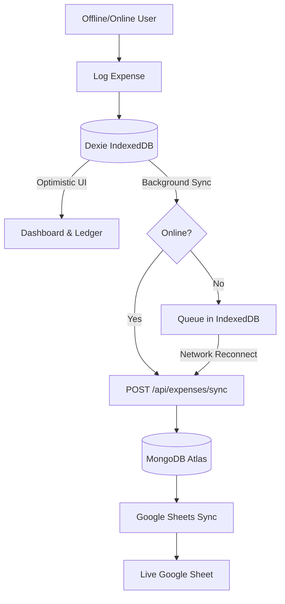

# BudgetFlow — Design System, UI & UX Flow Specification (`style.md`)

This document outlines the complete visual design system, glassmorphism UI architecture, interactive patterns, and user experience flows implemented in BudgetFlow.

---

## 1. Visual Philosophy & Glassmorphic Depth System

BudgetFlow is designed around **quiet luxury** and **physical believability**. Rather than decorative transparency, surfaces simulate frosted glass as a structural physical material.

### 1.1 The Three-Layer Depth Model

```
┌────────────────────────────────────────────────────────┐
│ Layer 3: Surface (Frosted Glass Panels, Buttons)      │  ← Inset 1px light-catch top rim
├────────────────────────────────────────────────────────┤
│ Layer 2: Diffusion (Reflected Back-Gradients & Blurs)  │  ← Backdrop blur (10px–20px)
├────────────────────────────────────────────────────────┤
│ Layer 1: Atmosphere (Ambient Base Gradients & Light)   │  ← Directional soft radial fields
└────────────────────────────────────────────────────────┘
```

1. **Layer 1: Atmosphere (Ambient Canvas)**
   - Not a flat color, but a soft field of directional light.
   - Light mode combines warm cream (`#F5F0E8`), soft sage (`#E8EDE3`), and subtle emerald ambient blooms.
   - Dark mode uses deep forest near-blacks (`#08120B` → `#0D1C12`) with luminous muted emerald highlights.
2. **Layer 2: Diffusion (Subsurface Reflection)**
   - Elements behind panels are diffused using `backdrop-filter: blur()`.
   - Never stack heavy blurs (`blur(20px)` on `blur(20px)`) to avoid muddy visual fog.
3. **Layer 3: Surface (Interactive Glass Panels)**
   - Every glass panel must feature a **top-edge specular highlight**: `inset 0 1px 0 rgba(255,255,255,0.6–0.9)`.
   - This single highlight simulates light hitting the physical bevel edge of glass, providing tangible thickness and depth.

---

## 2. Color Palette & Typography

### 2.1 Color Tokens

| Token | Light Mode Value | Dark Mode Value | Usage |
|---|---|---|---|
| **Accent (Emerald)** | `#22C55E` / `hsl(142, 71%, 45%)` | `#34D399` / `hsl(142, 71%, 50%)` | Primary CTA buttons, active states, progress indicators |
| **Accent Glow** | `rgba(34, 197, 94, 0.22)` | `rgba(52, 211, 153, 0.25)` | Focus rings, hover states, subtle ambient highlights |
| **Background (Atmosphere)** | Warm champagne-sage gradient | Dark emerald-carbon gradient | Base page canvas |
| **Surface Strong** | `rgba(255, 255, 255, 0.65)` | `rgba(16, 32, 22, 0.70)` | Hero summary cards, modals, primary widgets |
| **Surface Mid** | `rgba(255, 255, 255, 0.42)` | `rgba(16, 32, 22, 0.50)` | Content cards, transaction lists, feature blocks |
| **Surface Light** | `rgba(255, 255, 255, 0.28)` | `rgba(16, 32, 22, 0.35)` | Nested items, stat badges, input backgrounds |
| **Text Primary** | `#16281A` (warm near-black) | `#EBF5EE` (warm off-white) | Main headings, primary values |
| **Text Secondary** | `#455A4A` (neutral sage) | `#A3B8A8` (light sage) | Subtitles, section descriptions, labels |
| **Text Muted** | `#768D7B` (soft muted) | `#698270` (deep muted) | Timestamps, secondary metadata, placeholders |
| **Semantic Warning** | `#F59E0B` (Amber) | `#FBBF24` (Amber) | "Delete & Resync Fresh", warning modals |
| **Semantic Danger** | `#E11D48` (Rose) | `#FB7185` (Rose) | Unlink sheet, delete transaction, empty recycle bin |

### 2.2 Typography System

- **UI & Controls**: Modern geometric sans-serif (`Inter`, system stack) for crisp, legible UI elements.
- **Numbers & Currencies**: Tabular lining figures (`font-variant-numeric: tabular-nums`) so financial amounts align precisely.
- **Headings**: Warm editorial serif or clean modern bold display for major titles.

---

## 3. UI Component Architecture

BudgetFlow enforces strict UI component consistency:

### 3.1 `GlassCard`
- The foundational surface container.
- Available in three distinct depth tiers:
  - `variant="strong"`: Hero metrics, interactive modals (`blur(20px)`, `border-white/70`).
  - `variant="mid"`: Transaction list, settings groups (`blur(16px)`, `border-white/50`).
  - `variant="light"`: Nested chips, secondary stats (`blur(10px)`, `border-white/30`).
- Features responsive top-edge highlight and soft ambient drop shadows.

### 3.2 `Button`
- **Variants**:
  - `primary`: Solid emerald gradient with white text and subtle depth shadow.
  - `accent-ghost`: Translucent emerald tinted glass with crisp border.
  - `ghost`: Transparent with neutral hover effect.
  - `danger`: Soft rose glass for destructive actions.
- Touch target: Minimum **44px** height for ergonomic mobile tap accuracy.
- Active state: Spring micro-compression (`active:scale-[0.98]`).

### 3.3 `SelectSheet` & Modal Dialogs
- Native HTML `<select>` elements are avoided on mobile devices.
- Replaced by sliding bottom sheets with large touch targets and backdrop blur.
- Modals utilize `motion/react` spring physics:
  - Damping: `30`
  - Stiffness: `320`
- **Mobile Overflow Prevention**: Every modal dialog and sheet strictly enforces `min-w-0`, `max-w-full`, and `overflow-x-hidden`. Inner text containers utilize `.truncate` to prevent horizontal blowouts on compact mobile screens. Viewport heights strictly employ `100dvh` to absorb mobile browser address bar transitions.

### 3.4 Shared Dashboard Components & Analytics
- **Spending Breakdown (`SharedSpendingBreakdown`)**:
  - Period tabs: `[Day | Week | Month]` pill switcher.
  - View switcher: `[Graph | Table | Both]` allowing viewers to inspect Recharts bar charts and/or detailed tables.
  - Micro-metric stat cards displaying Total Spend, Active Periods, Average Spend, and Peak Spend.
- **Paginated Receipts (`SharedExpensesList`)**:
  - 10-item pagination with active emerald pill indicators and ellipsis for large ranges.
  - Bounded scroll container (`max-h-[440px] sm:max-h-[520px] custom-scrollbar`) with sticky date headers in trip mode.
  - Auto-reset to page 1 on filter or trip change, with smooth scroll to top on page switches.

### 3.5 Notifications & Feedback
- Native browser `alert()` and `confirm()` are strictly forbidden.
- Global toast notifications handled via `react-hot-toast` with emerald-accented glass aesthetics.
- Copy actions feature immediate inline icon feedback (`CheckCircle2` with "Copied!" state) alongside toast notifications.

---

## 4. End-to-End User Experience (UX) Flows



### 4.1 Authentication & Silent Session Flow
1. **Google OAuth**: One-click Google sign-in captures offline access tokens and Google Drive/Sheets scopes.
2. **Credentials Flow**: Secure email/password login returning dual access/refresh tokens.
3. **Silent Session Maintenance**: Short-lived JWT access tokens (`15m`) paired with long-lived refresh tokens (`30d`). Requests encountering expired access tokens trigger silent background refresh without user interruption.

### 4.2 Offline-First Transaction Logging Flow
1. **Instant Write**: When the user enters an expense, it writes immediately to local IndexedDB (Dexie) with `syncStatus: "pending"`.
2. **Zero Latency**: UI immediately updates balances, spend totals, and lists without waiting for network responses.
3. **Background Sync**: `useSync` detects network status and pushes queued mutations to `/api/expenses/sync`.
4. **Server Reconciliation**: Client temporary IDs (`clientId`) are matched to permanent MongoDB `_id`s, updating local state seamlessly.

### 4.3 Google Sheets Synchronization Flow

BudgetFlow provides a bidirectional sync and management lifecycle with Google Drive:

```
                      Google Sheets Integration
                                │
        ┌───────────────────────┼───────────────────────┐
        ▼                       ▼                       ▼
 1. Standard Sync      2. Fresh Resync         3. Link & Share
 (In-Place Update)     (Delete & Recreate)    (Copy URL / ID)
        │                       │                       │
 Updates exact same    Confirms in modal,      One-click clipboard
 sheet via atomic      trashes old Drive       copy with visual
 batchUpdate; avoids   file, and builds fresh  checkmark feedback
 duplicate files       sheet from scratch      and direct browser link
```

1. **In-Place Sheet Update (`Sync Changes`)**:
   - Checks the user's `sheetsSpreadsheetId`.
   - If present, fetches the existing spreadsheet from Google Drive.
   - Clears existing data ranges (`'Expenses'!A:Z` and `'Summary by Tag'!A:Z`).
   - Writes updated ledger entries and tag aggregations **directly into the same sheet**.
   - Preserves existing sheet URL and ID, preventing duplicate files from polluting Google Drive.
   - Incorporates collision protection so already-merged headers or existing basic filters do not abort formatting.
2. **Fresh Resync (`Delete & Resync`)**:
   - Accessible via the Profile page action toolbar.
   - Triggers an explanatory warning modal (`ConfirmModal`):
     > *"This will delete your existing Google Sheet from Google Drive and generate a clean, brand-new spreadsheet with all your transactions and category breakdowns. Continue?"*
   - On confirmation, calls `POST /api/export/sheets` with `{ action: "fresh" }`.
   - Deletes/trashes the old file from Google Drive, creates a fresh spreadsheet, and updates the user's database records.
3. **Link Sharing & One-Click Copy**:
   - **Spreadsheet URL**: Displayed in a monospace container with a quick "Copy Link" button and an "Open Sheet" external link button.
   - **Spreadsheet ID**: Explicitly displayed with its own dedicated copy button for easy reference.
4. **Token Refresh Persistence**:
   - Google API client hooks into token refresh events (`oauth2Client.on("tokens")`) to write new tokens to MongoDB automatically, avoiding sudden expiration errors.

### 4.4 Analytics & Spend Velocity Flow
1. **Interactive Date Ranging**: Quick presets (Today, This Week, This Month, Last Month, All Time) or custom calendar ranges.
2. **Category Tag Filtering**: Multi-select tag filters that update query parameters and persist filter state across navigation.
3. **Spend Pacing**: Real-time monthly spend pacing gauge with projected end-of-month spend based on current burn rate.

### 4.5 Soft-Delete & Recycle Bin Flow
1. **Safe Removal**: Deleting an expense removes it from active ledger calculations and archives it in `DeleteLog`.
2. **Recycle Bin Hub**: Users can view all deleted records in the Profile page Recycle Bin.
3. **Instant Recovery**: One-click "Restore" button places the record back into active transactions.
4. **Permanent Purge**: Options to permanently delete single records or "Empty Entire Recycle Bin".

### 4.6 Public Dashboard Sharing Flow
1. **Read-Only Token Generation**: Users can generate a secure tokenized share link (`/share/[shareId]`).
2. **Parent/Dependent View**: Displays monthly summary, savings progress, and category breakdowns without exposing private transaction notes or allowing modifications.
3. **Instant Revocation**: Users can regenerate or revoke the share link at any time from Profile settings.

---

## 5. Mobile Ergonomics & Navigation

- **Mobile (< 768px)**:
  - Fixed bottom glass navigation bar with thumb-friendly buttons for Dashboard, Expenses, Savings, and Profile.
  - Floating action button (FAB) or dedicated bottom-sheet forms for rapid expense entry.
  - Dialogs render as bottom-sliding drawer sheets.
- **Desktop (≥ 768px)**:
  - Collapsible left glass sidebar with expanded analytics navigation and shortcut keys.
  - Centered spring modals with full keyboard accessibility (`Esc` to dismiss, `Enter` to submit).
